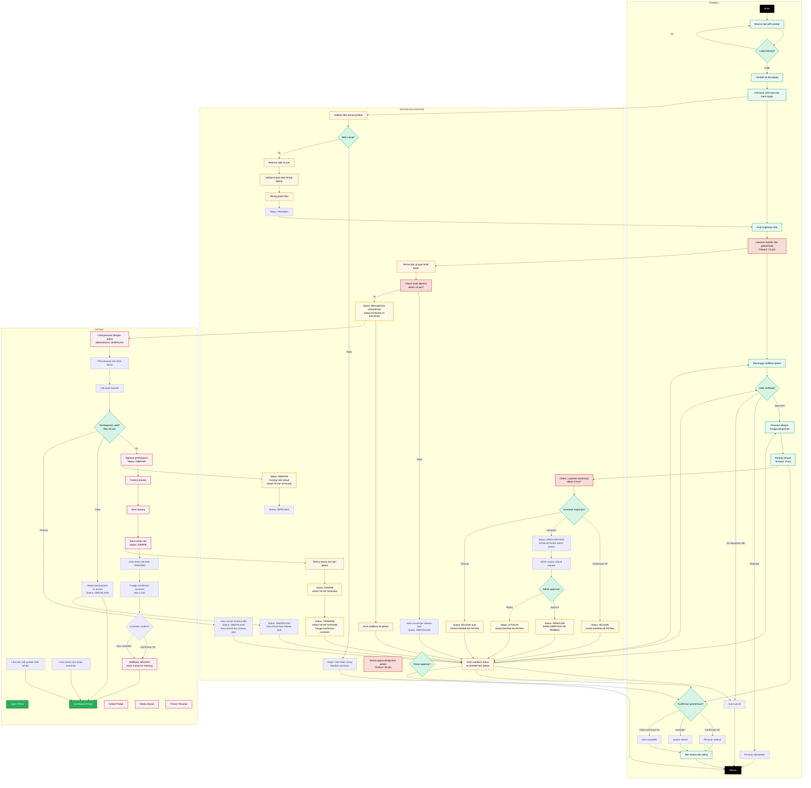
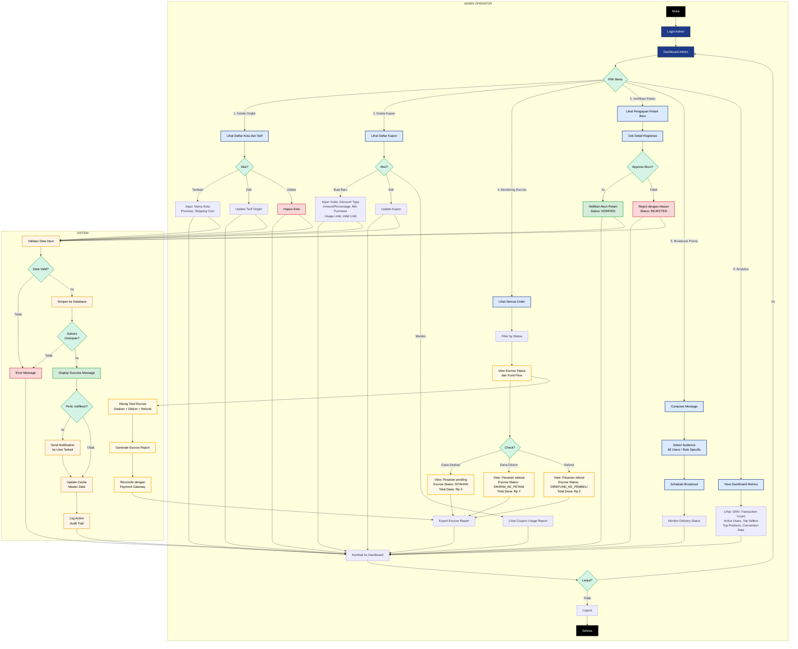

# Activity Diagram: Aktivitas Utama & Petani

```mermaid
graph TB
    %% ================== PEMBELI ==================
    subgraph Pembeli["PEMBELI"]
        P1[Mulai] --> P2[Browse dan pilih produk]
        P2 --> P2a{Lanjut belanja?}
        P2a -->|Ya| P2
        P2a -->|Tidak| P3[Tambah ke keranjang]
        P3 --> P4[Checkout: pilih kota dan input kupon]
        P4 --> P5[Lihat ringkasan total]
        P5 --> P6[Lakukan transfer dan upload bukti<br/>Timeout: 24 jam]
        P6 --> P7[Menunggu verifikasi petani]
        P7 --> P8{Hasil verifikasi?}
        P8 -->|Approved| P9[Pesanan dibayar<br/>Tunggu pengiriman]
        P8 -->|Rejected| P8b[Pesanan dibatalkan]
        P8 -->|No Response 48h| P8c[Auto-cancel]
        P8b --> P11
        P8c --> P11
        P9 --> P10[Barang sampai<br/>Timeout: 3 hari]
        P10 --> P10a{Konfirmasi penerimaan?}
        P10a -->|Konfirmasi OK| P10b[Pesanan selesai]
        P10a -->|Komplain| P10c[Ajukan refund]
        P10a -->|Tidak konfirmasi 3d| P10d[Auto-complete]
        P10b --> P12[Beri review dan rating]
        P10c --> P12
        P10d --> P12
        P12 --> P11[Selesai]
    end

    %% ================== SISTEM ==================
    subgraph Sistem["SISTEM dan ESCROW"]
        %% Checkout Phase
        S1[Validasi stok semua produk]
        S2{Stok cukup?}
        S3[Reject: stok tidak cukup<br/>batalkan pesanan]
        S4[Reserve stok 24 jam]
        S5[Validasi kupon dan hitung diskon]
        S6[Hitung grand total]
        S7[Status: PENDING]

        %% Payment Phase
        S8[Terima dan simpan bukti bayar]
        S9[Check: bukti diterima<br/>dalam 24 jam?]
        S10[Auto-cancel dan release stok<br/>Status: DIBATALKAN]
        S11[Status: MENUNGGU VERIFIKASI<br/>DANA DITAHAN DI ESCROW]
        S12[Kirim notifikasi ke petani]

        %% Verification Phase
        S13[Terima approval/rejection petani<br/>Timeout: 48 jam]
        S14{Petani approve?}
        S15[Status: DIBAYAR<br/>Kurangi stok aktual<br/>DANA TETAP DITAHAN]
        S16[Status: DIBATALKAN<br/>Auto-refund dan release stok]
        S17[Auto-cancel: timeout 48h<br/>Status: DIBATALKAN<br/>Auto-refund dan release stok]

        %% Shipping Phase
        S18[Status: DIPROSES]
        S19[Terima nomor resi dari petani]
        S20[Status: DIKIRIM<br/>DANA TETAP DITAHAN]
        S21[Status: TERKIRIM<br/>DANA TETAP DITAHAN<br/>Tunggu konfirmasi customer]

        %% Confirmation Phase
        S22[Check: customer konfirmasi<br/>dalam 3 hari?]
        S23{Customer response?}
        S24[Status: SELESAI<br/>DANA DIKIRIM KE PETANI]
        S25[Status: SELESAI auto<br/>DANA DIKIRIM KE PETANI]
        S26[Status: MINTA REFUND<br/>DANA DITAHAN admin review]

        %% Refund Phase
        S27[Admin review refund request]
        S28{Admin approve?}
        S29[Status: DIREFUND<br/>DANA DIREFUND KE PEMBELI]
        S30[Status: DITOLAK<br/>DANA DIKIRIM KE PETANI]

        %% Notifikasi
        S31[Kirim notifikasi status<br/>ke pembeli dan petani]
    end

    %% ================== PETANI ==================
    subgraph Petani["PETANI"]
        F0[Login Petani]
        F1[Dashboard Petani]
        F2[Kelola Produk]
        F3[Lihat dan edit produk milik sendiri]
        F3 --> F1

        F4[Kelola Ulasan]
        F5[Lihat ulasan dan balas komentar]
        F5 --> F1

        F6[Proses Pesanan]
        F7[Lihat pesanan dengan status<br/>MENUNGGU VERIFIKASI]
        F8[Pilih pesanan dan lihat detail]
        F9[Cek bukti transfer]
        F10{Pembayaran valid?<br/>Max 48 jam}
        F11[Approve pembayaran<br/>Status: DIBAYAR]
        F12[Reject pembayaran<br/>isi alasan<br/>Status: DIBATALKAN]
        F12 --> F1
        F11 --> F13[Packing barang]
        F13 --> F14[Kirim barang]
        F14 --> F15[Input nomor resi<br/>Status: DIKIRIM]
        F15 --> F16[Lihat status berubah TERKIRIM]
        F16 --> F17[Tunggu konfirmasi customer<br/>Max 3 hari]
        F17 --> F18{Customer confirm?}
        F18 -->|Konfirmasi OK| F19[Notifikasi: SELESAI<br/>Dana masuk ke rekening]
        F18 -->|Auto-complete| F19
        F19 --> F1
    end

    %% ============ KONEKSI PEMBELI - SISTEM CHECKOUT ============
    P4 --> S1
    S1 --> S2
    S2 -->|Tidak| S3
    S3 --> P11

    S2 -->|Ya| S4
    S4 --> S5
    S5 --> S6
    S6 --> S7
    S7 --> P5

    %% ============ KONEKSI PEMBELI - SISTEM PAYMENT dan TIMEOUT 24h ============
    P6 --> S8
    S8 --> S9
    S9 -->|Tidak| S10
    S10 --> S31
    S31 --> P8c

    S9 -->|Ya| S11
    S11 --> S12
    S12 --> S31
    S31 --> P7

    %% ============ KONEKSI SISTEM - PETANI VERIFIKASI 48h ============
    S11 --> F7
    F7 --> F8
    F8 --> F9
    F9 --> F10

    F10 -->|Ya| F11
    F10 -->|Tidak| F12
    F10 -->|Timeout| S17

    %% ============ KONEKSI PETANI - SISTEM APPROVAL ============
    F11 --> S15
    F12 --> S16
    
    S15 --> S18
    S16 --> S31
    S31 --> P8
    S17 --> S31

    %% ============ KONEKSI PETANI - SISTEM PENGIRIMAN ============
    F15 --> S19
    S19 --> S20
    S20 --> S21
    S21 --> S31
    S31 --> P9

    %% ============ KONEKSI SISTEM - PEMBELI KONFIRMASI 3d ============
    P10 --> S22
    S22 --> S23
    S23 -->|Konfirmasi OK| S24
    S23 -->|Komplain| S26
    S23 -->|Timeout| S25

    S24 --> S31
    S25 --> S31
    S31 --> P10a

    %% ============ KONEKSI SISTEM REFUND ============
    S26 --> S27
    S27 --> S28
    S28 -->|Approve| S29
    S28 -->|Reject| S30
    S29 --> S31
    S30 --> S31
    S31 --> P10a

    %% ============ STYLE ============
    style P1 fill:#000,stroke:#000,color:#fff
    style P11 fill:#000,stroke:#000,color:#fff
    style F0 fill:#27ae60,stroke:#000,color:#fff
    style F1 fill:#27ae60,stroke:#000,color:#fff
    
    classDef pembeli fill:#e8f8f5,stroke:#27ae60,color:#000,stroke-width:2px
    classDef sistem fill:#fef5e7,stroke:#f39c12,color:#000,stroke-width:2px
    classDef petani fill:#fdeef4,stroke:#e91e63,color:#000,stroke-width:2px
    classDef escrow fill:#fff9e6,stroke:#fbc02d,color:#000,stroke-width:3px
    classDef timeout fill:#fadbd8,stroke:#c0392b,color:#000,stroke-width:2px
    classDef decision fill:#d5f4e6,stroke:#27ae60,color:#000,stroke-width:2px
    
    class P2,P3,P4,P5,P6,P7,P9,P10,P12 pembeli
    class S1,S4,S5,S6,S8,S12,S19,S31 sistem
    class S11,S15,S20,S21,S24,S25,S29,S30 escrow
    class P6,F10,S9,S22,S13 timeout
    class P2a,P8,P10a,F10,S2,S14,S23,S28 decision
    class F2,F4,F6,F7,F11,F13,F14,F15,F19 petani


```

# Activity Diagram: Admin Operations

```mermaid
graph TB
    %% ================== ADMIN ==================
    subgraph Admin["ADMIN OPERATOR"]
        A1[Mulai] --> A2[Login Admin]
        A2 --> A3[Dashboard Admin]
        A3 --> A4{Pilih Menu}

        %% Menu 1: Kelola Ongkir
        A4 -->|1. Kelola Ongkir| A5[Lihat Daftar Kota dan Tarif]
        A5 --> A6{Aksi?}
        A6 -->|Tambah| A7[Input: Nama Kota<br/>Province, Shipping Cost]
        A6 -->|Edit| A8[Update Tarif Ongkir]
        A6 -->|Delete| A9[Hapus Kota]

        %% Menu 2: Kelola Kupon
        A4 -->|2. Kelola Kupon| A10[Lihat Daftar Kupon]
        A10 --> A11{Aksi?}
        A11 -->|Buat Baru| A12[Input: Kode, Discount Type<br/>Amount/Percentage, Min Purchase<br/>Usage Limit, Valid Until]
        A11 -->|Edit| A13[Update Kupon]
        A11 -->|Monitor| A14[Lihat Coupon Usage Report]

        %% Menu 3: Escrow Monitoring
        A4 -->|3. Monitoring Escrow| A15[Lihat Semua Order]
        A15 --> A16[Filter by Status]
        A16 --> A17[View Escrow Status<br/>dan Fund Flow]
        A17 --> A18{Check?}
        A18 -->|Dana Ditahan| A19[View: Pesanan pending<br/>Escrow Status: DITAHAN<br/>Total Dana: Rp X]
        A18 -->|Dana Dikirim| A20[View: Pesanan selesai<br/>Escrow Status: DIKIRIM_KE_PETANI<br/>Total Dana: Rp Y]
        A18 -->|Refund| A21[View: Pesanan refund<br/>Escrow Status: DIREFUND_KE_PEMBELI<br/>Total Dana: Rp Z]
        A19 --> A22[Export Escrow Report]
        A20 --> A22
        A21 --> A22

        %% Menu 4: Verifikasi Petani
        A4 -->|4. Verifikasi Petani| A23[Lihat Pengajuan Petani Baru]
        A23 --> A24[Cek Detail Registrasi]
        A24 --> A25{Approve Akun?}
        A25 -->|Ya| A26[Aktifkan Akun Petani<br/>Status: VERIFIED]
        A25 -->|Tidak| A27[Reject dengan Alasan<br/>Status: REJECTED]

        %% Menu 5: Broadcast Notifikasi
        A4 -->|5. Broadcast Promo| A28[Compose Message]
        A28 --> A29[Select Audience<br/>All Users / Role Specific]
        A29 --> A30[Schedule Broadcast]
        A30 --> A31[Monitor Delivery Status]

        %% Menu 6: Dashboard Analytics
        A4 -->|6. Analytics| A32[View Dashboard Metrics]
        A32 --> A33[Lihat: GMV, Transaction Count<br/>Active Users, Top Sellers<br/>Top Products, Conversion Rate]

        %% Kembali ke dashboard
        A7 --> A34[Kembali ke Dashboard]
        A8 --> A34
        A9 --> A34
        A12 --> A34
        A13 --> A34
        A14 --> A34
        A22 --> A34
        A26 --> A34
        A27 --> A34
        A31 --> A34
        A33 --> A34
        A34 --> A35{Lanjut?}
        A35 -->|Ya| A3
        A35 -->|Tidak| A36[Logout]
        A36 --> A37[Selesai]
    end

    %% ================== SISTEM ==================
    subgraph Sistem["SISTEM"]
        %% Data Validation
        B1[Validasi Data Input]
        B2{Data Valid?}
        B3[Error Message]
        B4[Simpan ke Database]
        B5{Sukses<br/>Disimpan?}
        B6[Display Success Message]

        %% Notification dan Update
        B7{Perlu notifikasi?}
        B8[Send Notification<br/>ke User Terkait]
        B9[Update Cache<br/>Master Data]
        B10[Log Action<br/>Audit Trail]

        %% Escrow Specific
        B11[Hitung Total Escrow<br/>Ditahan + Dikirim + Refund]
        B12[Generate Escrow Report]
        B13[Reconcile dengan<br/>Payment Gateway]
    end

    %% ================== KONEKSI ADMIN - SISTEM ==================
    A7 --> B1
    A8 --> B1
    A9 --> B1
    A12 --> B1
    A13 --> B1
    A26 --> B1
    A27 --> B1

    B1 --> B2
    B2 -->|Tidak| B3
    B3 --> A34
    B2 -->|Ya| B4
    B4 --> B5
    B5 -->|Tidak| B3
    B5 -->|Ya| B6

    B6 --> B7
    B7 -->|Ya| B8
    B7 -->|Tidak| B9
    B8 --> B9
    B9 --> B10
    B10 --> A34

    %% Escrow Monitoring Flow
    A17 --> B11
    B11 --> B12
    B12 --> B13
    B13 --> A22

    %% ============ STYLE ============
    style A1 fill:#000,stroke:#000,color:#fff
    style A37 fill:#000,stroke:#000,color:#fff
    style A2 fill:#1e3a8a,stroke:#000,color:#fff
    style A3 fill:#1e3a8a,stroke:#000,color:#fff

    classDef admin fill:#dbeafe,stroke:#1e3a8a,color:#000,stroke-width:2px
    classDef sistem fill:#fef5e7,stroke:#f39c12,color:#000,stroke-width:2px
    classDef decision fill:#d5f4e6,stroke:#27ae60,color:#000,stroke-width:2px
    classDef escrow fill:#fff9e6,stroke:#fbc02d,color:#000,stroke-width:3px
    classDef success fill:#d4edda,stroke:#28a745,color:#000,stroke-width:2px
    classDef error fill:#f8d7da,stroke:#dc3545,color:#000,stroke-width:2px

    class A5,A10,A15,A23,A24,A28,A29,A30,A32 admin
    class B1,B4,B6,B8,B9,B10 sistem
    class A4,A6,A11,A18,A25,A35,B2,B5,B7 decision
    class A17,A19,A20,A21,B11,B12,B13 escrow
    class A26,B6 success
    class A27,B3,A9 error


```
