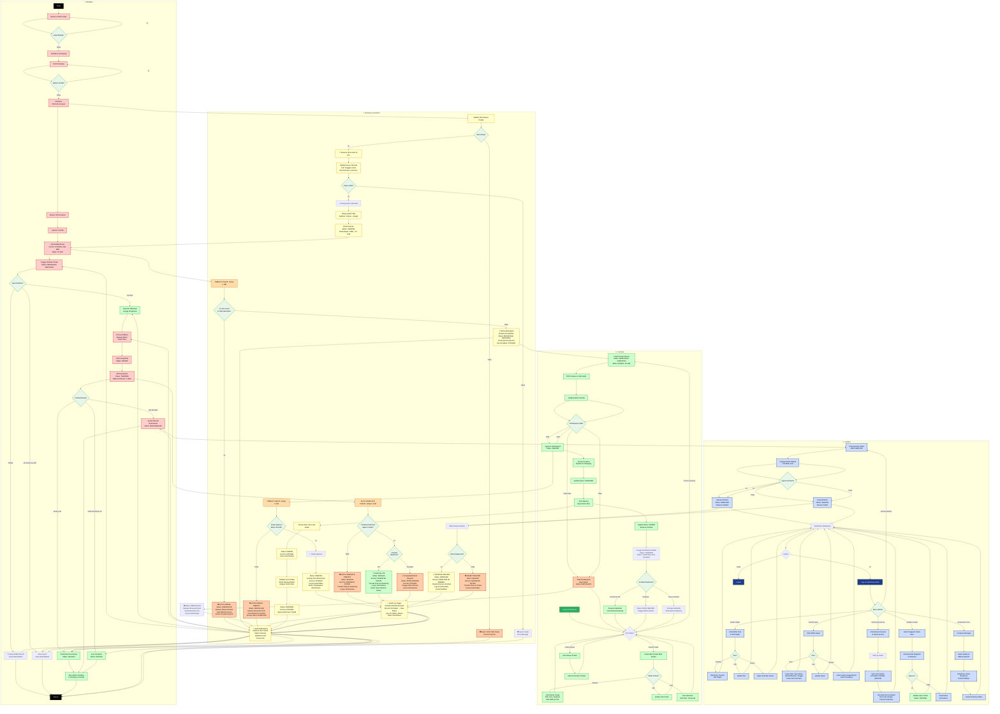
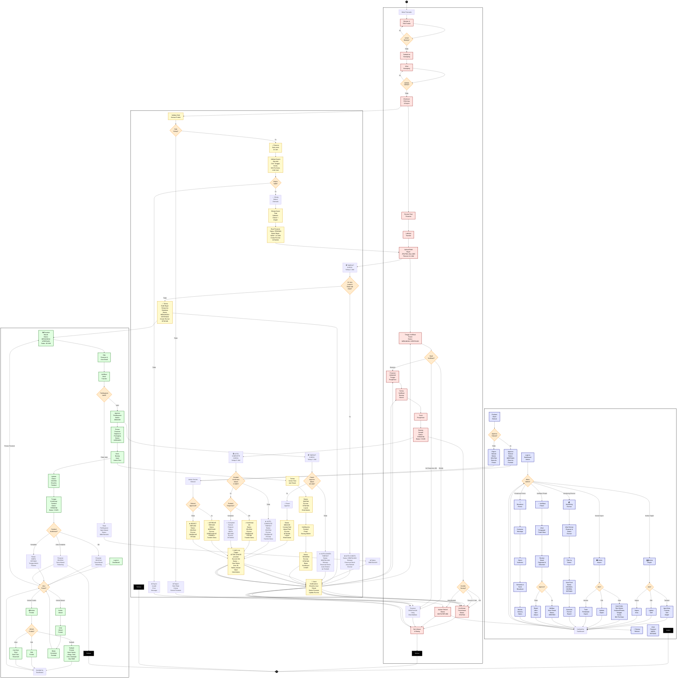

# Activity Diagram TANAMI

```mermaid
graph TB
    %% ================== PEMBELI ==================
    subgraph Pembeli["👥 PEMBELI"]
        P1[Mulai] --> P2[Browse & Pilih Produk]
        P2 --> P2a{Lanjut Belanja?}
        P2a -->|Ya| P2
        P2a -->|Tidak| P3[Tambah ke Keranjang]
        P3 --> P4[Lihat Keranjang]
        P4 --> P4a{Update Jumlah?}
        P4a -->|Ya| P4
        P4a -->|Tidak| P5[Checkout:<br/>Pilih Kota & Kupon]
        P5 --> P6[Review Total Pesanan]
        P6 --> P7[Lakukan Transfer]
        P7 --> P8[Upload Bukti Bayar<br/>Format: JPG/PNG, Max 2MB<br/>Batas: 24 JAM]
        P8 --> P9[Tunggu Verifikasi Petani<br/>Status: MENUNGGU VERIFIKASI]
        P9 --> P10{Hasil Verifikasi?}
        P10 -->|Ditolak| P10a[Pesanan DIBATALKAN<br/>Uang Dikembalikan]
        P10 -->|Disetujui| P11[Pesanan DIBAYAR<br/>Tunggu Pengiriman]
        P10 -->|No Response 48h| P10b[Auto-Cancel<br/>Uang Dikembalikan]
        P10a --> P31
        P10b --> P31
        P11 --> P12[Terima Notifikasi<br/>Barang Dikirim<br/>Nomor Resi]
        P12 --> P13[Track Pengiriman<br/>Status: DIKIRIM]
        P13 --> P14[Barang Sampai<br/>Status: TERKIRIM<br/>Batas Konfirmasi: 3 HARI]
        P14 --> P15{Kondisi Barang?}
        P15 -->|Barang OK| P16[Konfirmasi Penerimaan<br/>Status: SELESAI]
        P15 -->|Ada Masalah| P17[Ajukan Refund<br/>Input Alasan<br/>Status: MINTA REFUND]
        P15 -->|Tidak Konfirmasi 3d| P18[Auto-Complete<br/>Status: SELESAI]
        P16 --> P19[Beri Ulasan & Rating<br/>1-5 Bintang, Komentar]
        P17 --> P19
        P18 --> P19
        P19 --> P31[Selesai]
    end

    %% ================== PETANI ==================
    subgraph Petani["👨‍🌾 PETANI"]
        F0[Login & Dashboard]
        F0 --> F0a{Aksi Petani?}
        
        %% Sub-alur Kelola Produk
        F0a -->|Kelola Produk| F1[Lihat Daftar Produk Milik Sendiri]
        F1 --> F2{CRUD Produk?}
        F2 -->|Tambah| F3[Input Nama, Harga<br/>Stok, Foto, Deskripsi<br/>Max 5MB per foto]
        F2 -->|Edit| F4[Update Info Produk]
        F2 -->|Lihat| F5[Cek Stok Real<br/>Stok Fisik - Reserved]
        F3 --> F0a
        F4 --> F0a
        F5 --> F0a
        
        %% Sub-alur Terima & Proses Pesanan
        F0a -->|Proses Pesanan| F6[Lihat Pesanan Masuk<br/>Status: MENUNGGU VERIFIKASI<br/>Batas Verifikasi: 48 JAM]
        F6 --> F7[Pilih Pesanan & Lihat Detail]
        F7 --> F8[Verifikasi Bukti Transfer]
        F8 --> F9{Pembayaran Valid?}
        F9 -->|Tidak Valid| F10[Tolak Pembayaran<br/>Input Alasan<br/>Status: DIBATALKAN]
        F9 -->|Valid| F11[Approve Pembayaran<br/>Status: DIBAYAR]
        F10 --> F0a
        F11 --> F12[Proses Pesanan<br/>Siapkan & Packaging]
        F12 --> F13[Update Status: DIPROSES]
        F13 --> F14[Kirim Barang<br/>Input Nomor Resi]
        F14 --> F15[Update Status: DIKIRIM<br/>Email ke Pembeli]
        F15 --> F16[Tunggu Konfirmasi Pembeli<br/>Status: TERKIRIM<br/>Batas: 3 HARI atau Auto-Complete]
        F16 --> F17{Pembeli Konfirmasi?}
        F17 -->|Konfirmasi OK| F18[Pesanan SELESAI<br/>Dana Masuk Rekening]
        F17 -->|Komplain| F18a[Status: MINTA REFUND<br/>Tunggu Admin Review]
        F17 -->|Auto-Complete| F18b[Pesanan SELESAI<br/>Dana Masuk Rekening]
        F18 --> F0a
        F18a --> F0a
        F18b --> F0a
        
        %% Sub-alur Kelola Ulasan
        F0a -->|Kelola Ulasan| F20[Lihat Ulasan Produk]
        F20 --> F21[Balas Komentar Pembeli]
        F21 --> F0a
    end

    %% ================== ADMIN ==================
    subgraph Admin["👨‍💼 ADMIN"]
        A1[Login & Dashboard Admin]
        A1 --> A2{Menu Admin?}
        
        %% Sub-alur Manajemen Kota & Ongkir
        A2 -->|Kelola Ongkir| A3[Lihat Daftar Kota<br/>& Tarif Ongkir]
        A3 --> A4{Aksi?}
        A4 -->|Tambah| A5[Input Kota, Provinsi<br/>Tarif Ongkir]
        A4 -->|Edit| A6[Update Tarif]
        A4 -->|Hapus| A7[Hapus Kota dari Sistem]
        A5 --> A50
        A6 --> A50
        A7 --> A50
        
        %% Sub-alur Kelola Kupon
        A2 -->|Kelola Kupon| A8[Lihat Daftar Kupon]
        A8 --> A9{Aksi?}
        A9 -->|Buat| A10[Input Kode, Tipe Diskon<br/>Nominal/Persen, Tanggal<br/>Kuota, Min Purchase]
        A9 -->|Edit| A11[Update Kupon]
        A9 -->|Monitor| A12[Lihat Coupon Usage Report<br/>Track Pemakaian]
        A10 --> A50
        A11 --> A50
        A12 --> A50
        
        %% Sub-alur Monitoring Escrow
        A2 -->|Monitoring Escrow| A13[Lihat Semua Pesanan<br/>& Status Escrow]
        A13 --> A14[Filter by Status]
        A14 --> A15[View Fund Status:<br/>DITAHAN, DIKIRIM, REFUND]
        A15 --> A16[Generate Escrow Report<br/>Reconcile dengan Payment Gateway]
        A16 --> A50
        
        %% Sub-alur Verifikasi Petani
        A2 -->|Verifikasi Petani| A17[Lihat Pengajuan Petani Baru]
        A17 --> A18[Review Detail Registrasi<br/>& Dokumen]
        A18 --> A19{Approve?}
        A19 -->|Ya| A20[Aktifkan Akun Petani<br/>Status: VERIFIED]
        A19 -->|Tidak| A21[Reject Akun<br/>Input Alasan]
        A20 --> A50
        A21 --> A50
        
        %% Sub-alur Broadcast Promo
        A2 -->|Broadcast Promo| A22[Compose Message]
        A22 --> A23[Select Audience<br/>All/Role Specific]
        A23 --> A24[Schedule & Send Broadcast<br/>Email Notifikasi]
        A24 --> A25[Monitor Delivery Status]
        A25 --> A50
        
        %% Sub-alur Review Refund
        A2 -->|Review Refund| A26[Lihat Pesanan Status<br/>MINTA REFUND]
        A26 --> A27[Evaluasi Klaim Refund<br/>Cek Bukti, Foto]
        A27 --> A28{Approve Refund?}
        A28 -->|Ya| A29[Approve Refund<br/>Status: DIREFUND<br/>Dana ke Pembeli]
        A28 -->|Tidak| A30[Reject Refund<br/>Status: SELESAI<br/>Dana ke Petani]
        A29 --> A50
        A30 --> A50
        
        A50[Kembali ke Dashboard]
        A50 --> A51{Lanjut?}
        A51 -->|Ya| A1
        A51 -->|Tidak| A52[Logout]
    end

    %% ================== SISTEM ==================
    subgraph Sistem["🤖 SISTEM & ESCROW"]
        %% Fase Checkout & Validasi Stok
        S1[Validasi Stok Semua Produk]
        S2{Stok Cukup?}
        S3[❌ Reject: Stok Tidak Cukup<br/>Cancel Pesanan]
        S4[✓ Reserve Stok untuk 24 jam]
        S5[Validasi Kupon Jika Ada<br/>Cek: Tanggal, Kuota<br/>Min Purchase, Limit User]
        S6{Kupon Valid?}
        S6a[❌ Kupon Invalid<br/>Error Message]
        S6b[✓ Hitung Diskon Otomatis]
        S7[Hitung Grand Total<br/>Subtotal - Diskon + Ongkir]
        S8[Buat Pesanan<br/>Status: PENDING<br/>Batas Bayar: NOW + 24 JAM]
        
        %% Fase Payment Timeout 24 Jam
        S9[TIMEOUT CHECK: Setiap 1 JAM]
        S10{24 Jam Lewat<br/>& Tidak Ada Bukti?}
        S11[❌ AUTO-CANCEL<br/>Status: DIBATALKAN<br/>Release Reserved Stock<br/>Auto-Refund Escrow<br/>Email: Pesanan Expired]
        S12[✓ Terima Bukti Bayar<br/>Simpan ke Database<br/>Status: MENUNGGU VERIFIKASI<br/>Create Escrow Record<br/>Escrow Status: DITAHAN]
        
        %% Fase Verification Timeout 48 Jam
        S13[TIMEOUT CHECK: Setiap 1 JAM]
        S14{Petani Approve<br/>dalam 48 JAM?}
        S15[❌ AUTO-CANCEL TIMEOUT<br/>Status: DIBATALKAN<br/>Release Reserved Stock<br/>Auto-Refund ke Pembeli<br/>Escrow Status: DIREFUND]
        S16[✓ Petani Approve]
        S17[Status: DIBAYAR<br/>Kurangi Stok Aktual Fisik<br/>Escrow: DITAHAN<br/>Log ke Historistatus<br/>Email: Pembayaran Dikonfirmasi]
        
        %% Fase Pengiriman
        S18[Terima Nomor Resi dari Petani]
        S19[Status: DIKIRIM<br/>Escrow: DITAHAN<br/>Log ke Historistatus]
        S20[Notifikasi ke Pembeli<br/>Email: Barang Dikirim<br/>dengan Nomor Resi]
        S21[Status: TERKIRIM<br/>Escrow: DITAHAN<br/>Batas Konfirmasi: 3 HARI]
        
        %% Fase Confirmation Timeout 3 Hari & Auto-Complete
        S22[AUTO-COMPLETE CHECK: Setiap 6 JAM]
        S23{Pembeli Konfirmasi<br/>dalam 3 HARI?}
        S24[❌ AUTO-COMPLETE TIMEOUT<br/>Status: SELESAI<br/>Escrow: DIKIRIM KE PETANI<br/>Transfer Dana ke Rekening<br/>Log ke Historistatus]
        S25{Pembeli<br/>Response?}
        S26[✓ Konfirmasi OK<br/>Status: SELESAI<br/>Escrow: DIKIRIM KE PETANI<br/>Transfer Dana ke Rekening<br/>Log ke Historistatus<br/>Email: Dana Diterima Petani]
        S27[⚠ Komplain/Refund Request<br/>Status: MINTA REFUND<br/>Escrow: DITAHAN<br/>Tunggu Admin Review<br/>Log ke Historistatus]
        
        %% Fase Refund Admin Review
        S28[Admin Review Refund]
        S29{Refund Approved?}
        S30[✓ APPROVE REFUND<br/>Status: DIREFUND<br/>Escrow: DIREFUND KE PEMBELI<br/>Transfer Dana ke Pembeli<br/>Log ke Historistatus<br/>Email Notifikasi]
        S31[❌ REJECT REFUND<br/>Status: SELESAI<br/>Escrow: DIKIRIM KE PETANI<br/>Transfer Dana ke Petani<br/>Log ke Historistatus]
        
        %% Audit Log & Trigger
        S32[📝 Audit Log Trigger<br/>AFTER UPDATE pesanan<br/>Record: Old Status → New Status<br/>User ID, Waktu, Alasan<br/>Tabel: historistatus]
        
        %% Notifikasi
        S33[📧 Send Notifications<br/>Email ke User Terkait<br/>Status Pesanan<br/>Update Escrow<br/>Promo Info]
    end

    %% ================== KONEKSI PEMBELI - SISTEM ==================
    P5 --> S1
    S1 --> S2
    S2 -->|Tidak| S3
    S3 --> P31
    S2 -->|Ya| S4
    S4 --> S5
    S5 --> S6
    S6 -->|Tidak| S6a
    S6a --> P31
    S6 -->|Ya| S6b
    S6b --> S7
    S7 --> S8
    S8 --> P8

    P8 --> S9
    S9 --> S10
    S10 -->|Ya| S11
    S11 --> S33
    S33 --> P10b
    S10 -->|Tidak| S12
    S12 --> S33
    S33 --> P9

    %% ================== KONEKSI SISTEM - PETANI (Verifikasi) ==================
    S12 --> F6
    F8 --> F9
    F9 -->|Tidak| F10
    F10 --> S17a["❌ Status: DIBATALKAN<br/>Release Reserved Stock<br/>Auto-Refund Escrow<br/>Log ke Historistatus"]
    S17a --> S33
    S33 --> P10a
    
    F9 -->|Valid| F11
    F11 --> S13
    S13 --> S14
    S14 -->|Tidak| S15
    S15 --> S33
    S33 --> P10b
    S14 -->|Ya| S16
    S16 --> S17
    S17 --> S32
    S32 --> S33
    S33 --> P11

    %% ================== KONEKSI PETANI - SISTEM (Pengiriman) ==================
    F14 --> S18
    S18 --> S19
    S19 --> S20
    S20 --> S21
    S21 --> S33
    S33 --> P12

    %% ================== KONEKSI SISTEM - PEMBELI (Konfirmasi) ==================
    P14 --> S22
    S22 --> S23
    S23 -->|Tidak| S24
    S24 --> S32
    S32 --> S33
    S33 --> P18
    
    S23 -->|Ya| S25
    S25 -->|OK| S26
    S26 --> S32
    S32 --> S33
    S33 --> P16
    
    S25 -->|Komplain| S27
    S27 --> S32
    S32 --> S33
    S33 --> P17

    %% ================== KONEKSI ADMIN - SISTEM (Refund Review) ==================
    P17 --> A26
    A27 --> A28
    A28 -->|Ya| A29
    A29 --> S28
    S28 --> S29
    S29 -->|Ya| S30
    S30 --> S32
    S32 --> S33
    S33 --> P16
    
    A28 -->|Tidak| A30
    A30 --> S28
    S29 -->|Tidak| S31
    S31 --> S32
    S32 --> S33
    S33 --> P16

    %% ============ STYLING ============
    style P1 fill:#000,stroke:#000,color:#fff
    style P31 fill:#000,stroke:#000,color:#fff
    style F0 fill:#27ae60,stroke:#000,color:#fff
    style A1 fill:#1e3a8a,stroke:#000,color:#fff
    style A52 fill:#1e3a8a,stroke:#000,color:#fff

    classDef pembeli fill:#ffcccc,stroke:#c0392b,color:#000,stroke-width:2px
    classDef petani fill:#ccffcc,stroke:#27ae60,color:#000,stroke-width:2px
    classDef admin fill:#ccddff,stroke:#1e3a8a,color:#000,stroke-width:2px
    classDef sistem fill:#ffffcc,stroke:#f39c12,color:#000,stroke-width:2px
    classDef timeout fill:#ffddaa,stroke:#e67e22,color:#000,stroke-width:2px
    classDef decision fill:#e8f5e9,stroke:#27ae60,color:#000,stroke-width:2px
    classDef error fill:#ffccaa,stroke:#c0392b,color:#000,stroke-width:2px
    classDef success fill:#ccffcc,stroke:#27ae60,color:#000,stroke-width:2px

    class P2,P3,P4,P5,P6,P7,P8,P9,P11,P12,P13,P14,P16,P17,P19 pembeli
    class F1,F3,F4,F5,F6,F7,F8,F11,F12,F13,F14,F15,F20,F21 petani
    class A3,A5,A6,A7,A8,A10,A11,A12,A13,A15,A16,A17,A18,A20,A21,A22,A23,A24,A25,A26,A27,A29,A30 admin
    class S1,S4,S5,S7,S8,S12,S17,S18,S19,S20,S21,S26,S30,S31,S32,S33 sistem
    class S9,S13,S22 timeout
    class P2a,P4a,P10,P15,A2,A4,A9,A19,A28,F2,F9,F17,S2,S6,S10,S14,S23,S25,S29 decision
    class S3,S11,S15,S24,S27,S31,F10 error
    class P11,P16,P18,P19,A20,F11,F18,S26 success


```

# UML ACTIVITY DIAGRAM

```mermaid
graph TD
    Start((●)) --> P_Start["Mulai Transaksi"]
    
    %% ================== SWIMLANE PEMBELI ==================
    subgraph Pembeli[" "]
        P_Start --> P1["Browse &<br/>Pilih Produk"]
        P1 --> P2{"Lanjut<br/>Belanja?"}
        P2 -->|Ya| P1
        P2 -->|Tidak| P3["Tambah ke<br/>Keranjang"]
        P3 --> P4["Lihat<br/>Keranjang"]
        P4 --> P5{"Update<br/>Jumlah?"}
        P5 -->|Ya| P4
        P5 -->|Tidak| P6["Checkout:<br/>Pilih Kota<br/>& Kupon"]
        P6 --> P7["Review Total<br/>Pesanan"]
        P7 --> P8["Lakukan<br/>Transfer"]
        P8 --> P9["Upload Bukti<br/>Bayar<br/>JPG/PNG, Max 2MB<br/>Timeout: 24 JAM"]
        P9 --> P10["Tunggu Verifikasi<br/>Petani<br/>Status:<br/>MENUNGGU VERIFIKASI"]
        P10 --> P11{"Hasil<br/>Verifikasi?"}
        P11 -->|Disetujui| P12["Pesanan<br/>DIBAYAR<br/>Tunggu<br/>Pengiriman"]
        P11 -->|Ditolak| P13["Pesanan<br/>DIBATALKAN<br/>Uang<br/>Dikembalikan"]
        P11 -->|No Response 48h| P13
        P12 --> P14["Terima<br/>Notifikasi<br/>Barang<br/>Dikirim"]
        P14 --> P15["Track<br/>Pengiriman"]
        P15 --> P16["Barang<br/>Sampai<br/>Status:<br/>TERKIRIM<br/>Batas: 3 HARI"]
        P16 --> P17{"Kondisi<br/>Barang?"}
        P17 -->|OK| P18["Konfirmasi<br/>Penerimaan<br/>Status:<br/>SELESAI"]
        P17 -->|Ada Masalah| P19["Ajukan Refund<br/>Status:<br/>MINTA REFUND"]
        P17 -->|Timeout 3 Hari| P18
        P18 --> P20["Beri Ulasan<br/>& Rating"]
        P19 --> P20
        P13 --> P20
        P20 --> P_End["Selesai"]
    end
    
    %% ================== SWIMLANE SISTEM ==================
    subgraph Sistem[" "]
        S1["Validasi Stok<br/>Semua Produk"]
        S2{"Stok<br/>Cukup?"}
        S3["❌ Reject:<br/>Stok Tidak<br/>Cukup<br/>Cancel Pesanan"]
        S4["✓ Reserve<br/>Stok untuk<br/>24 Jam"]
        S5["Validasi Kupon<br/>Jika Ada<br/>Cek: Tanggal,<br/>Kuota,<br/>Min Purchase,<br/>Limit User"]
        S6{"Kupon<br/>Valid?"}
        S6a["❌ Kupon<br/>Invalid<br/>Error<br/>Message"]
        S6b["✓ Hitung<br/>Diskon<br/>Otomatis"]
        S7["Hitung Grand<br/>Total<br/>Subtotal -<br/>Diskon +<br/>Ongkir"]
        S8["Buat Pesanan<br/>Status: PENDING<br/>Batas Bayar:<br/>NOW + 24 JAM<br/>Create Escrow:<br/>DITAHAN"]
        
        S9["⏳ TIMEOUT<br/>CHECK:<br/>Setiap 1 JAM"]
        S10{"24 Jam<br/>Lewat &<br/>Tidak Ada<br/>Bukti?"}
        S11["❌ AUTO-CANCEL<br/>Status: DIBATALKAN<br/>Release<br/>Reserved Stock<br/>Auto-Refund<br/>Escrow"]
        S12["✓ Terima<br/>Bukti Bayar<br/>Simpan ke<br/>Database<br/>Status:<br/>MENUNGGU<br/>VERIFIKASI<br/>Create Escrow:<br/>DITAHAN"]
        
        S13["⏳ TIMEOUT<br/>CHECK:<br/>Setiap 1 JAM"]
        S14{"Petani<br/>Approve<br/>dalam<br/>48 JAM?"}
        S15["❌ AUTO-CANCEL<br/>TIMEOUT<br/>Status:<br/>DIBATALKAN<br/>Release<br/>Reserved Stock<br/>Auto-Refund<br/>ke Pembeli"]
        S16["✓ Petani<br/>Approve"]
        S17["Status:<br/>DIBAYAR<br/>Kurangi Stok<br/>Aktual Fisik<br/>Escrow:<br/>DITAHAN<br/>Log ke<br/>Historistatus"]
        
        S18["Terima<br/>Nomor Resi<br/>dari Petani"]
        S19["Status:<br/>DIKIRIM<br/>Escrow:<br/>DITAHAN<br/>Log ke<br/>Historistatus"]
        S20["Notifikasi ke<br/>Pembeli<br/>Email:<br/>Barang Dikirim"]
        S21["Status:<br/>TERKIRIM<br/>Escrow:<br/>DITAHAN<br/>Batas<br/>Konfirmasi:<br/>3 HARI"]
        
        S22["⏳ AUTO-<br/>COMPLETE<br/>CHECK:<br/>Setiap 6 JAM"]
        S23{"Pembeli<br/>Konfirmasi<br/>dalam<br/>3 HARI?"}
        S24["❌ AUTO-<br/>COMPLETE<br/>TIMEOUT<br/>Status:<br/>SELESAI<br/>Escrow:<br/>DIKIRIM KE<br/>PETANI<br/>Transfer Dana"]
        S25{"Pembeli<br/>Response?"}
        S26["✓ Konfirmasi<br/>OK<br/>Status:<br/>SELESAI<br/>Escrow:<br/>DIKIRIM KE<br/>PETANI<br/>Transfer Dana"]
        S27["⚠ Komplain/<br/>Refund<br/>Request<br/>Status:<br/>MINTA<br/>REFUND<br/>Escrow:<br/>DITAHAN"]
        
        S28["Admin Review<br/>Refund"]
        S29{"Refund<br/>Approved?"}
        S30["✓ APPROVE<br/>REFUND<br/>Status:<br/>DIREFUND<br/>Escrow:<br/>DIREFUND KE<br/>PEMBELI<br/>Transfer Dana"]
        S31["❌ REJECT<br/>REFUND<br/>Status:<br/>SELESAI<br/>Escrow:<br/>DIKIRIM KE<br/>PETANI"]
        
        S32["📝 Audit Log<br/>Trigger<br/>AFTER UPDATE<br/>pesanan<br/>Record: Old<br/>Status →<br/>New Status<br/>User ID,<br/>Waktu, Alasan<br/>Tabel:<br/>historistatus"]
        
        S33["📧 Send<br/>Notifications<br/>Email ke User<br/>Terkait<br/>Status Pesanan<br/>Update Escrow"]
        
        S_End["Selesai"]
    end
    
    %% ================== SWIMLANE PETANI ==================
    subgraph Petani[" "]
        F1["Login &<br/>Dashboard"]
        F2{"Aksi<br/>Petani?"}
        
        F3["📦 Kelola<br/>Produk"]
        F4{"CRUD<br/>Produk?"}
        F5["Tambah<br/>Produk<br/>Input: Nama,<br/>Harga, Stok,<br/>Foto, Deskripsi<br/>Max 5MB"]
        F6["Edit<br/>Produk"]
        F7["Cek Stok<br/>Real<br/>Stok Fisik -<br/>Reserved"]
        F8["Kembali ke<br/>Dashboard"]
        
        F9["📥 Pesanan<br/>Masuk<br/>Status:<br/>MENUNGGU<br/>VERIFIKASI<br/>Batas: 48 JAM"]
        F10["Pilih<br/>Pesanan &<br/>Lihat Detail"]
        F11["Verifikasi<br/>Bukti<br/>Transfer"]
        F12{"Pembayaran<br/>Valid?"}
        F13["Tolak<br/>Pembayaran<br/>Input Alasan<br/>Status:<br/>DIBATALKAN"]
        F14["Approve<br/>Pembayaran<br/>Status:<br/>DIBAYAR"]
        F15["Proses<br/>Pesanan<br/>Siapkan &<br/>Packaging<br/>Status:<br/>DIPROSES"]
        F16["Kirim<br/>Barang<br/>Input<br/>Nomor Resi"]
        F17["Update<br/>Status:<br/>DIKIRIM<br/>Email ke<br/>Pembeli"]
        F18["Tunggu<br/>Konfirmasi<br/>Pembeli<br/>Status:<br/>TERKIRIM<br/>Batas: 3 HARI"]
        F19{"Pembeli<br/>Konfirmasi?"}
        F20["Pesanan<br/>SELESAI<br/>Dana Masuk<br/>Rekening"]
        F21["Status:<br/>MINTA<br/>REFUND<br/>Tunggu Admin<br/>Review"]
        F22["Pesanan<br/>SELESAI<br/>Dana Masuk<br/>Rekening"]
        
        F23["Kelola<br/>Ulasan"]
        F24["Lihat<br/>Ulasan<br/>Produk"]
        F25["Balas<br/>Komentar<br/>Pembeli"]
        
        F_End["Selesai"]
    end
    
    %% ================== SWIMLANE ADMIN ==================
    subgraph Admin[" "]
        A1["Login &<br/>Dashboard<br/>Admin"]
        A2{"Menu<br/>Admin?"}
        
        A3["🗺️ Kelola<br/>Ongkir"]
        A4{"Aksi?"}
        A5["Input Kota,<br/>Provinsi,<br/>Tarif<br/>Ongkir"]
        A6["Update<br/>Tarif"]
        A7["Hapus<br/>Kota"]
        A8["Kembali ke<br/>Dashboard"]
        
        A9["🎟️ Kelola<br/>Kupon"]
        A10{"Aksi?"}
        A11["Input Kode,<br/>Tipe Diskon,<br/>Nominal/Persen,<br/>Tanggal,<br/>Kuota,<br/>Min Purchase"]
        A12["Update<br/>Kupon"]
        A13["Track<br/>Pemakaian<br/>Kupon"]
        
        A14["💰<br/>Monitoring<br/>Escrow"]
        A15["Lihat Semua<br/>Pesanan &<br/>Status<br/>Escrow"]
        A16["Filter by<br/>Status"]
        A17["View Fund<br/>Status:<br/>DITAHAN,<br/>DIKIRIM,<br/>REFUND"]
        A18["Generate<br/>Escrow<br/>Report"]
        
        A19["✅ Verifikasi<br/>Petani"]
        A20["Lihat<br/>Pengajuan<br/>Petani Baru"]
        A21["Review<br/>Detail<br/>Registrasi &<br/>Dokumen"]
        A22{"Approve?"}
        A23["Aktifkan<br/>Akun Petani<br/>Status:<br/>VERIFIED"]
        A24["Reject<br/>Akun<br/>Input<br/>Alasan"]
        
        A25["📢<br/>Broadcast<br/>Promo"]
        A26["Compose<br/>Message"]
        A27["Select<br/>Audience"]
        A28["Schedule &<br/>Send<br/>Broadcast"]
        A29["Monitor<br/>Delivery<br/>Status"]
        
        A30["🔄 Review<br/>Refund"]
        A31["Lihat<br/>Pesanan<br/>MINTA<br/>REFUND"]
        A32["Evaluasi<br/>Klaim<br/>Refund"]
        A33{"Approve<br/>Refund?"}
        A34["Approve<br/>Refund<br/>Status:<br/>DIREFUND<br/>Dana ke<br/>Pembeli"]
        A35["Reject<br/>Refund<br/>Status:<br/>SELESAI<br/>Dana ke<br/>Petani"]
        
        A_End["Logout"]
    end
    
    %% ================== KONEKSI PEMBELI - SISTEM ==================
    P6 --> S1
    S1 --> S2
    S2 -->|Tidak| S3
    S3 --> P20
    S2 -->|Ya| S4
    S4 --> S5
    S5 --> S6
    S6 -->|Tidak| S6a
    S6a --> P20
    S6 -->|Ya| S6b
    S6b --> S7
    S7 --> S8
    S8 --> P9
    
    P9 --> S9
    S9 --> S10
    S10 -->|Ya| S11
    S11 --> S33
    S33 --> P13
    S10 -->|Tidak| S12
    S12 --> S33
    S33 --> P10
    
    %% ================== KONEKSI SISTEM - PETANI ==================
    S12 --> F9
    F11 --> F12
    F12 -->|Tidak Valid| F13
    F13 --> S17a["❌ Status:<br/>DIBATALKAN"]
    S17a --> S33
    S33 --> P13
    
    F12 -->|Valid| F14
    F14 --> S13
    S13 --> S14
    S14 -->|Tidak| S15
    S15 --> S33
    S33 --> P13
    S14 -->|Ya| S16
    S16 --> S17
    S17 --> S32
    S32 --> S33
    S33 --> P12
    
    %% ================== KONEKSI PETANI - SISTEM (PENGIRIMAN) ==================
    F16 --> S18
    S18 --> S19
    S19 --> S20
    S20 --> S21
    S21 --> S33
    S33 --> P14
    
    %% ================== KONEKSI SISTEM - PEMBELI (KONFIRMASI) ==================
    P16 --> S22
    S22 --> S23
    S23 -->|Tidak| S24
    S24 --> S32
    S32 --> S33
    S33 --> P18
    
    S23 -->|Ya| S25
    S25 -->|OK| S26
    S26 --> S32
    S32 --> S33
    S33 --> P18
    
    S25 -->|Komplain| S27
    S27 --> S32
    S32 --> S33
    S33 --> P19
    
    %% ================== KONEKSI ADMIN - SISTEM (REFUND) ==================
    P19 --> A30
    A32 --> A33
    A33 -->|Ya| A34
    A34 --> S28
    S28 --> S29
    S29 -->|Ya| S30
    S30 --> S32
    S32 --> S33
    S33 --> P18
    
    A33 -->|Tidak| A35
    A35 --> S28
    S29 -->|Tidak| S31
    S31 --> S32
    S32 --> S33
    S33 --> P18
    
    %% ================== INTERNAL PETANI ==================
    F1 --> F2
    F2 -->|Kelola Produk| F3
    F3 --> F4
    F4 -->|Tambah| F5
    F4 -->|Edit| F6
    F4 -->|Lihat| F7
    F5 --> F8
    F6 --> F8
    F7 --> F8
    F8 --> F2
    
    F2 -->|Proses Pesanan| F9
    F9 --> F10
    F10 --> F11
    
    F14 --> F15
    F15 --> F16
    F16 --> F17
    F17 --> F18
    F18 --> F19
    F19 -->|OK| F20
    F19 -->|Komplain| F21
    F19 -->|Auto-Complete| F22
    F20 --> F2
    F21 --> F2
    F22 --> F2
    
    F2 -->|Kelola Ulasan| F23
    F23 --> F24
    F24 --> F25
    F25 --> F2
    F22 --> F_End
    
    %% ================== INTERNAL ADMIN ==================
    A1 --> A2
    
    A2 -->|Kelola Ongkir| A3
    A3 --> A4
    A4 -->|Tambah| A5
    A4 -->|Edit| A6
    A4 -->|Hapus| A7
    A5 --> A8
    A6 --> A8
    A7 --> A8
    A8 --> A2
    
    A2 -->|Kelola Kupon| A9
    A9 --> A10
    A10 -->|Buat| A11
    A10 -->|Edit| A12
    A10 -->|Monitor| A13
    A11 --> A8
    A12 --> A8
    A13 --> A8
    
    A2 -->|Monitoring Escrow| A14
    A14 --> A15
    A15 --> A16
    A16 --> A17
    A17 --> A18
    A18 --> A8
    
    A2 -->|Verifikasi Petani| A19
    A19 --> A20
    A20 --> A21
    A21 --> A22
    A22 -->|Ya| A23
    A22 -->|Tidak| A24
    A23 --> A8
    A24 --> A8
    
    A2 -->|Broadcast Promo| A25
    A25 --> A26
    A26 --> A27
    A27 --> A28
    A28 --> A29
    A29 --> A8
    
    A8 --> A2
    
    A_End --> End((●))
    P_End --> End
    F_End --> End
    S_End --> End

    %% ============ STYLING ============
    classDef pembeli fill:#FFE4E1,stroke:#8B0000,color:#000,stroke-width:2px
    classDef sistem fill:#FFFACD,stroke:#DAA520,color:#000,stroke-width:2px
    classDef petani fill:#E1FFE1,stroke:#006400,color:#000,stroke-width:2px
    classDef admin fill:#E1E5FF,stroke:#00008B,color:#000,stroke-width:2px
    classDef decision fill:#FFEBCD,stroke:#FF8C00,color:#000,stroke-width:2px
    classDef startend fill:#000,stroke:#000,color:#fff,stroke-width:2px
    classDef swimlane fill:none,stroke:#000,color:#000,stroke-width:2px

    class P1,P3,P4,P6,P7,P8,P9,P10,P12,P14,P15,P16,P18,P19,P20 pembeli
    class S1,S4,S5,S7,S8,S12,S17,S18,S19,S20,S21,S26,S30,S31,S32,S33 sistem
    class F1,F3,F4,F5,F6,F7,F9,F10,F11,F14,F15,F16,F17,F18,F23,F24,F25 petani
    class A1,A3,A4,A5,A6,A7,A9,A10,A11,A12,A13,A14,A15,A16,A17,A18,A19,A20,A21,A23,A24,A25,A26,A27,A28,A29,A30,A31,A32,A34,A35 admin
    class P2,P5,P11,P17,F2,F4,F12,F19,A2,A4,A10,A22,A33,S2,S6,S10,S14,S23,S25,S29 decision
    class Start,End,P_End,S_End,F_End,A_End startend
    class Pembeli,Sistem,Petani,Admin swimlane

```
