# Activity Diagram Transaksi Utama with Exception Handling


# Activity Diagram Petani (Seller)

```mermaid
graph TB
    subgraph Petani["🌾 PETANI (SELLER)"]
        A1[Start] --> A2[Login Petani]
        A2 --> A3[Dashboard Petani]
        A3 --> A4{Pilih Menu}
        
        A4 -->|Kelola Produk| A5[Lihat Katalog<br/>Produk Saya]
        A5 --> A6{Aksi Produk?}
        A6 -->|Tambah| A7[Input Nama, Harga,<br/>Stok, Kategori, Foto]
        A6 -->|Edit| A8[Update Data Produk]
        A6 -->|Hapus| A9[Hapus Produk]
        
        A4 -->|Proses Pesanan| A10[Lihat Order Masuk]
        A10 --> A11[Pilih Order Status<br/>Awaiting Payment]
        A11 --> A12[Download & Cek<br/>Bukti Transfer]
        A12 --> A13{Bukti Transfer<br/>Valid?}
        A13 -->|Ya| A14[Approve Pembayaran]
        A14 --> A15[Packing Produk]
        A15 --> A16[Kirim Barang]
        A16 --> A17[Input Nomor Resi]
        A17 --> A18[Update Status: Shipped]
        A13 -->|Tidak| A19[Tolak Pembayaran]
        A19 --> A20[Input Alasan Penolakan]
        
        A4 -->|Kelola Ulasan| A21[Lihat Review Produk]
        A21 --> A22[Balas Komentar Pembeli<br/>opsional]
        
        A7 --> A23[Kembali ke Dashboard]
        A8 --> A23
        A9 --> A23
        A18 --> A23
        A20 --> A23
        A22 --> A23
        A23 --> A24[End]
    end
    
    subgraph Sistem["⚙️ SISTEM"]
        B1[Validasi Data Produk]
        B2{Stok & Harga<br/>Valid?}
        B3[Simpan ke Database]
        B4[Tampilkan Error]
        B5[Update Reserved Stock]
        B6[Kurangi Stok Aktual]
        B7[Release Reserved Stock]
        B8[Send Notifikasi<br/>ke Pembeli]
        B9[Update Status Order]
    end
    
    subgraph Pembeli["👤 PEMBELI"]
        C1[Terima Notifikasi Status]
        C2{Status =<br/>Shipped?}
        C3[Terima Paket]
        C4[Konfirmasi Penerimaan]
        C5[Status: Completed]
        C6[Beri Review & Rating]
    end
    
    A7 --> B1
    A8 --> B1
    B1 --> B2
    B2 -->|Ya| B3
    B2 -->|Tidak| B4
    B4 --> A23
    B3 --> A23
    
    A11 --> B5
    A14 --> B6
    B6 --> A15
    A19 --> B7
    A20 --> B7
    B7 --> B8
    
    A18 --> B9
    B9 --> B8
    B8 --> C1
    C1 --> C2
    C2 -->|Ya| C3
    C2 -->|Tidak| C1
    C3 --> C4
    C4 --> C5
    C5 --> C6
    
%% STYLE
style A1 fill:#000,stroke:#000,color:#fff
style A24 fill:#000,stroke:#000,color:#fff
classDef white fill:#fff,stroke:#000,color:#000;
class A2,A3,A4,A5,A7,A8,A9,A10,A11,A12,A13,A14,A15,A16,A17,A18,A19,A20,A21,A22,A23 white;
class B1,B2,B3,B4,B5,B6,B7,B8,B9 white;
class C1,C2,C3,C4,C5,C6 white;


```



# Activity Diagram Admin

```mermaid
graph TB
    subgraph Admin["👨‍💼 ADMIN (OPERATOR)"]
        A1[Start] --> A2[Login Admin]
        A2 --> A3[Dashboard Admin]
        A3 --> A4{Pilih Menu}
        
        A4 -->|Kelola Ongkir| A5[Lihat Daftar Kota]
        A5 --> A6{Aksi?}
        A6 -->|Tambah| A7[Input Nama Kota<br/>& Tarif]
        A6 -->|Edit| A8[Update Harga Ongkir]
        
        A4 -->|Kelola Kupon| A9[Lihat Daftar Kupon]
        A9 --> A10{Aksi?}
        A10 -->|Buat Baru| A11[Input Kode, Diskon<br/>& Expired Date]
        A10 -->|Nonaktifkan| A12[Set Status: Inactive]
        
        A4 -->|Monitoring| A13[Lihat Semua Order]
        A13 --> A14[Filter & Export Data]
        
        A4 -->|Verifikasi Petani| A15[Lihat Pengajuan Petani]
        A15 --> A16{Approve<br/>Akun?}
        A16 -->|Ya| A17[Aktifkan Akun Petani]
        A16 -->|Tidak| A18[Tolak dengan Alasan]
        
        A7 --> A19[Kembali ke Dashboard]
        A8 --> A19
        A11 --> A19
        A12 --> A19
        A14 --> A19
        A17 --> A19
        A18 --> A19
        A19 --> A20[End]
    end
    
    subgraph Sistem["⚙️ SISTEM"]
        B1[Validasi Data Input]
        B2{Data Valid?}
        B3[Simpan ke Database]
        B4[Tampilkan Error]
        B5{Berhasil<br/>Disimpan?}
        B6[Tampilkan Pesan Sukses]
        B7[Send Notifikasi<br/>jika diperlukan]
        B8[Update Cache<br/>Master Data]
    end
    
    A7 --> B1
    A8 --> B1
    A11 --> B1
    A12 --> B1
    A17 --> B1
    A18 --> B1
    
    B1 --> B2
    B2 -->|Ya| B3
    B2 -->|Tidak| B4
    B4 --> A19
    B3 --> B5
    B5 -->|Ya| B6
    B5 -->|Tidak| B4
    B6 --> B7
    B7 --> B8
    B8 --> A19
    
%% STYLE
style A1 fill:#000,stroke:#000,color:#fff
style A20 fill:#000,stroke:#000,color:#fff

classDef white fill:#fff,stroke:#000,color:#000;
class A2,A3,A4,A5,A7,A8,A9,A11,A12,A13,A14,A15,A17,A18,A19 white;
class B1,B3,B4,B6,B7,B8 white;
