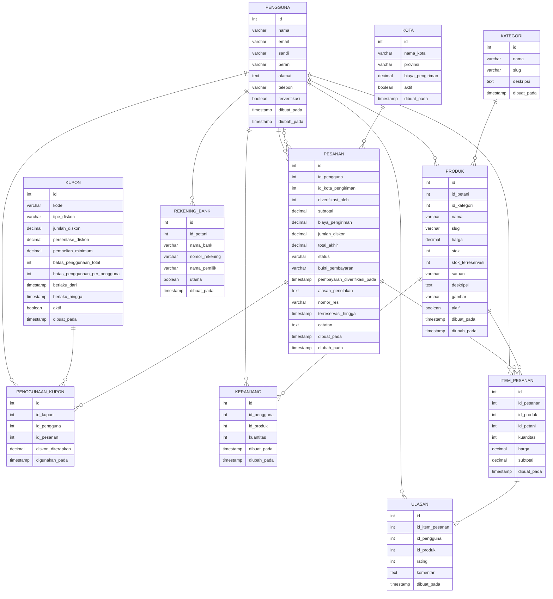

# Rancangan Database (ERD) & Struktur Data
## 
## Entity Relationship Diagram

```mermaid
erDiagram
PENGGUNA ||--o{ PRODUK : ""
PENGGUNA ||--o{ PESANAN : ""
PENGGUNA ||--o{ ULASAN : ""
PENGGUNA ||--o{ REKENING_BANK : ""
PENGGUNA ||--o{ PENGGUNAAN_KUPON : ""
PENGGUNA ||--o{ KERANJANG : ""
PENGGUNA ||--o{ ITEM_PESANAN : ""
PENGGUNA o|--o{ PESANAN : ""

KATEGORI ||--o{ PRODUK : ""
KOTA ||--o{ PESANAN : ""
KUPON ||--o{ PENGGUNAAN_KUPON : ""

PESANAN ||--o{ PENGGUNAAN_KUPON : ""
PESANAN ||--o{ ITEM_PESANAN : ""

PRODUK ||--o{ ITEM_PESANAN : ""
PRODUK ||--o{ KERANJANG : ""

ITEM_PESANAN ||--o| ULASAN : ""

PENGGUNA {
    int id
    varchar nama
    varchar email
    varchar sandi
    varchar peran
    text alamat
    varchar telepon
    boolean terverifikasi
    timestamp dibuat_pada
    timestamp diubah_pada
}

KATEGORI {
    int id
    varchar nama
    varchar slug
    text deskripsi
    timestamp dibuat_pada
}

PRODUK {
    int id
    int id_petani
    int id_kategori
    varchar nama
    varchar slug
    decimal harga
    int stok
    int stok_terreservasi
    varchar satuan
    text deskripsi
    varchar gambar
    boolean aktif
    timestamp dibuat_pada
    timestamp diubah_pada
}

KOTA {
    int id
    varchar nama_kota
    varchar provinsi
    decimal biaya_pengiriman
    boolean aktif
    timestamp dibuat_pada
}

KUPON {
    int id
    varchar kode
    varchar tipe_diskon
    decimal jumlah_diskon
    decimal persentase_diskon
    decimal pembelian_minimum
    int batas_penggunaan_total
    int batas_penggunaan_per_pengguna
    timestamp berlaku_dari
    timestamp berlaku_hingga
    boolean aktif
    timestamp dibuat_pada
}

PENGGUNAAN_KUPON {
    int id
    int id_kupon
    int id_pengguna
    int id_pesanan
    decimal diskon_diterapkan
    timestamp digunakan_pada
}

PESANAN {
    int id
    int id_pengguna
    int id_kota_pengiriman
    int diverifikasi_oleh
    decimal subtotal
    decimal biaya_pengiriman
    decimal jumlah_diskon
    decimal total_akhir
    varchar status
    varchar bukti_pembayaran
    timestamp pembayaran_diverifikasi_pada
    text alasan_penolakan
    varchar nomor_resi
    timestamp terreservasi_hingga
    text catatan
    timestamp dibuat_pada
    timestamp diubah_pada
}

ITEM_PESANAN {
    int id
    int id_pesanan
    int id_produk
    int id_petani
    int kuantitas
    decimal harga
    decimal subtotal
    timestamp dibuat_pada
}

ULASAN {
    int id
    int id_item_pesanan
    int id_pengguna
    int id_produk
    int rating
    text komentar
    timestamp dibuat_pada
}

REKENING_BANK {
    int id
    int id_petani
    varchar nama_bank
    varchar nomor_rekening
    varchar nama_pemilik
    boolean utama
    timestamp dibuat_pada
}

KERANJANG {
    int id
    int id_pengguna
    int id_produk
    int kuantitas
    timestamp dibuat_pada
    timestamp diubah_pada
}


```
