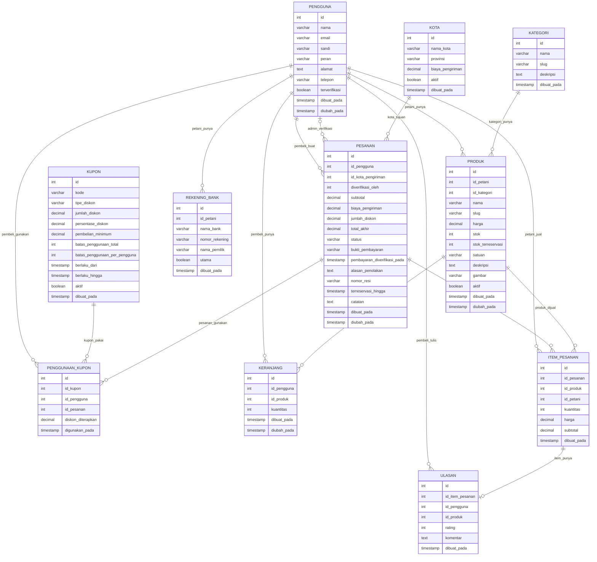

# Rancangan Database (ERD) & Struktur Data
## 
## Entity Relationship Diagram

## ERD Chen

```mermaid
graph TD
%% ENTITIES - Rectangle
PENGGUNA["<b>PENGGUNA</b>"]
KATEGORI["<b>KATEGORI</b>"]
PRODUK["<b>PRODUK</b>"]
KOTA["<b>KOTA</b>"]
KUPON["<b>KUPON</b>"]
PESANAN["<b>PESANAN</b>"]
ITEM_PESANAN["<b>ITEM_PESANAN</b>"]
ULASAN["<b>ULASAN</b>"]
REKENING_BANK["<b>REKENING_BANK</b>"]
KERANJANG["<b>KERANJANG</b>"]
PENGGUNAAN_KUPON["<b>PENGGUNAAN_KUPON</b>"]

%% RELATIONSHIPS - Diamond
R_PUNYA_PRODUK{{"<b>Punya</b><br/>Produk"}}
R_BUAT_PESANAN{{"<b>Buat</b><br/>Pesanan"}}
R_TULIS_ULASAN{{"<b>Tulis</b><br/>Ulasan"}}
R_PUNYA_REKENING{{"<b>Punya</b><br/>Rekening"}}
R_GUNAKAN_KUPON{{"<b>Gunakan</b><br/>Kupon"}}
R_PUNYA_KERANJANG{{"<b>Punya</b><br/>Keranjang"}}
R_PETANI_ITEM{{"<b>Petani</b><br/>Item"}}
R_VERIFIKASI{{"<b>Verifikasi</b>"}}
R_KATEGORI_PRODUK{{"<b>Kategori</b><br/>Produk"}}
R_KOTA_PESANAN{{"<b>Kota</b><br/>Pesanan"}}
R_KUPON_PAKAI{{"<b>Pakai</b><br/>Kupon"}}
R_PESANAN_KUPON{{"<b>Gunakan</b><br/>Kupon"}}
R_PESANAN_ITEM{{"<b>Berisi</b><br/>Item"}}
R_PRODUK_ITEM{{"<b>Produk</b><br/>Item"}}
R_PRODUK_KERANJANG{{"<b>Produk</b><br/>Keranjang"}}
R_ITEM_ULASAN{{"<b>Punya</b><br/>Ulasan"}}

%% ATTRIBUTES - Circle/Oval
%% PENGGUNA Attributes
A_ID_PG(["<u>id</u>"])
A_NAMA_PG(["nama"])
A_EMAIL_PG(["<u>email</u>"])
A_SANDI_PG(["sandi"])
A_PERAN_PG(["peran"])
A_ALAMAT_PG(["alamat"])
A_TELEPON_PG(["telepon"])
A_TERVERIF_PG(["terverifikasi"])
A_DIBUAT_PG(["dibuat_pada"])
A_DIUBAH_PG(["diubah_pada"])

%% KATEGORI Attributes
A_ID_KAT(["<u>id</u>"])
A_NAMA_KAT(["nama"])
A_SLUG_KAT(["<u>slug</u>"])
A_DESC_KAT(["deskripsi"])
A_DIBUAT_KAT(["dibuat_pada"])

%% PRODUK Attributes
A_ID_PRD(["<u>id</u>"])
A_ID_PETANI(["<u>id_petani</u> (FK)"])
A_ID_KAT_PRD(["<u>id_kategori</u> (FK)"])
A_NAMA_PRD(["nama"])
A_SLUG_PRD(["<u>slug</u>"])
A_HARGA(["harga"])
A_STOK(["stok"])
A_STOK_RES(["stok_terreservasi"])
A_SATUAN(["satuan"])
A_DESC_PRD(["deskripsi"])
A_GAMBAR(["gambar"])
A_AKTIF_PRD(["aktif"])
A_DIBUAT_PRD(["dibuat_pada"])
A_DIUBAH_PRD(["diubah_pada"])

%% KOTA Attributes
A_ID_KT(["<u>id</u>"])
A_NAMA_KOTA(["<u>nama_kota</u>"])
A_PROVINSI(["provinsi"])
A_BIAYA_KIRIM(["biaya_pengiriman"])
A_AKTIF_KT(["aktif"])
A_DIBUAT_KT(["dibuat_pada"])

%% KUPON Attributes
A_ID_KPN(["<u>id</u>"])
A_KODE(["<u>kode</u>"])
A_TIPE_DISKON(["tipe_diskon"])
A_JML_DISKON(["jumlah_diskon"])
A_PERSEN_DISKON(["persentase_diskon"])
A_BELI_MIN(["pembelian_minimum"])
A_BATAS_TOTAL(["batas_penggunaan_total"])
A_BATAS_USER(["batas_penggunaan_per_pengguna"])
A_BERLAKU_DARI(["berlaku_dari"])
A_BERLAKU_HINGGA(["berlaku_hingga"])
A_AKTIF_KPN(["aktif"])
A_DIBUAT_KPN(["dibuat_pada"])

%% PESANAN Attributes
A_ID_PS(["<u>id</u>"])
A_ID_PENJUAL(["id_pengguna (FK)"])
A_ID_KOTA_KIR(["id_kota_pengiriman (FK)"])
A_ID_VERIF(["id_verifikasi (FK)"])
A_SUBTOTAL(["subtotal"])
A_BIAYA_PS(["biaya_pengiriman"])
A_DISKON_PS(["jumlah_diskon"])
A_TOTAL_PS(["total_akhir"])
A_STATUS_PS(["status"])
A_BUKTI(["bukti_pembayaran"])
A_VERIF_PADA(["pembayaran_diverifikasi_pada"])
A_ALASAN(["alasan_penolakan"])
A_RESI(["nomor_resi"])
A_TERRESERVASI(["terreservasi_hingga"])
A_CATATAN(["catatan"])
A_DIBUAT_PS(["dibuat_pada"])
A_DIUBAH_PS(["diubah_pada"])

%% ITEM_PESANAN Attributes
A_ID_IP(["<u>id</u>"])
A_ID_PS_IP(["id_pesanan (FK)"])
A_ID_PRD_IP(["id_produk (FK)"])
A_ID_PETANI_IP(["id_petani (FK)"])
A_KUANTITAS(["kuantitas"])
A_HARGA_IP(["harga"])
A_SUBTOTAL_IP(["subtotal"])
A_DIBUAT_IP(["dibuat_pada"])

%% ULASAN Attributes
A_ID_UL(["<u>id</u>"])
A_ID_ITEM_UL(["<u>id_item_pesanan</u> (FK)"])
A_ID_PENG_UL(["id_pengguna (FK)"])
A_ID_PRD_UL(["id_produk (FK)"])
A_RATING(["rating"])
A_KOMENTAR(["komentar"])
A_DIBUAT_UL(["dibuat_pada"])

%% REKENING_BANK Attributes
A_ID_RK(["<u>id</u>"])
A_ID_PETANI_RK(["id_petani (FK)"])
A_NAMA_BANK(["nama_bank"])
A_NOMOR_RK(["nomor_rekening"])
A_NAMA_PEMILIK(["nama_pemilik"])
A_UTAMA(["utama"])
A_DIBUAT_RK(["dibuat_pada"])

%% KERANJANG Attributes
A_ID_KRJ(["<u>id</u>"])
A_ID_PENG_KRJ(["id_pengguna (FK)"])
A_ID_PRD_KRJ(["id_produk (FK)"])
A_KUANTITAS_KRJ(["kuantitas"])
A_DIBUAT_KRJ(["dibuat_pada"])
A_DIUBAH_KRJ(["diubah_pada"])

%% PENGGUNAAN_KUPON Attributes
A_ID_PK(["<u>id</u>"])
A_ID_KPN_PK(["id_kupon (FK)"])
A_ID_PENG_PK(["id_pengguna (FK)"])
A_ID_PS_PK(["id_pesanan (FK)"])
A_DISKON_TERAPKAN(["diskon_diterapkan"])
A_DIGUNAKAN_PADA(["digunakan_pada"])

%% RELATIONSHIPS (Kardinalitas 1:N)
%% PENGGUNA Relationships
PENGGUNA -->|1| R_PUNYA_PRODUK
R_PUNYA_PRODUK -->|N| PRODUK

PENGGUNA -->|1| R_BUAT_PESANAN
R_BUAT_PESANAN -->|N| PESANAN

PENGGUNA -->|1| R_TULIS_ULASAN
R_TULIS_ULASAN -->|N| ULASAN

PENGGUNA -->|1| R_PUNYA_REKENING
R_PUNYA_REKENING -->|N| REKENING_BANK

PENGGUNA -->|1| R_GUNAKAN_KUPON
R_GUNAKAN_KUPON -->|N| PENGGUNAAN_KUPON

PENGGUNA -->|1| R_PUNYA_KERANJANG
R_PUNYA_KERANJANG -->|N| KERANJANG

PENGGUNA -->|1| R_PETANI_ITEM
R_PETANI_ITEM -->|N| ITEM_PESANAN

PENGGUNA -->|0,N| R_VERIFIKASI
R_VERIFIKASI -->|1| PESANAN

%% KATEGORI Relationships
KATEGORI -->|1| R_KATEGORI_PRODUK
R_KATEGORI_PRODUK -->|N| PRODUK

%% KOTA Relationships
KOTA -->|1| R_KOTA_PESANAN
R_KOTA_PESANAN -->|N| PESANAN

%% KUPON Relationships
KUPON -->|1| R_KUPON_PAKAI
R_KUPON_PAKAI -->|N| PENGGUNAAN_KUPON

%% PESANAN Relationships
PESANAN -->|1| R_PESANAN_KUPON
R_PESANAN_KUPON -->|N| PENGGUNAAN_KUPON

PESANAN -->|1| R_PESANAN_ITEM
R_PESANAN_ITEM -->|N| ITEM_PESANAN

%% PRODUK Relationships
PRODUK -->|1| R_PRODUK_ITEM
R_PRODUK_ITEM -->|N| ITEM_PESANAN

PRODUK -->|1| R_PRODUK_KERANJANG
R_PRODUK_KERANJANG -->|N| KERANJANG

%% ITEM_PESANAN Relationships
ITEM_PESANAN -->|1| R_ITEM_ULASAN
R_ITEM_ULASAN -->|0,1| ULASAN

%% PENGGUNA Attributes
PENGGUNA --- A_ID_PG
PENGGUNA --- A_NAMA_PG
PENGGUNA --- A_EMAIL_PG
PENGGUNA --- A_SANDI_PG
PENGGUNA --- A_PERAN_PG
PENGGUNA --- A_ALAMAT_PG
PENGGUNA --- A_TELEPON_PG
PENGGUNA --- A_TERVERIF_PG
PENGGUNA --- A_DIBUAT_PG
PENGGUNA --- A_DIUBAH_PG

%% KATEGORI Attributes
KATEGORI --- A_ID_KAT
KATEGORI --- A_NAMA_KAT
KATEGORI --- A_SLUG_KAT
KATEGORI --- A_DESC_KAT
KATEGORI --- A_DIBUAT_KAT

%% PRODUK Attributes
PRODUK --- A_ID_PRD
PRODUK --- A_ID_PETANI
PRODUK --- A_ID_KAT_PRD
PRODUK --- A_NAMA_PRD
PRODUK --- A_SLUG_PRD
PRODUK --- A_HARGA
PRODUK --- A_STOK
PRODUK --- A_STOK_RES
PRODUK --- A_SATUAN
PRODUK --- A_DESC_PRD
PRODUK --- A_GAMBAR
PRODUK --- A_AKTIF_PRD
PRODUK --- A_DIBUAT_PRD
PRODUK --- A_DIUBAH_PRD

%% KOTA Attributes
KOTA --- A_ID_KT
KOTA --- A_NAMA_KOTA
KOTA --- A_PROVINSI
KOTA --- A_BIAYA_KIRIM
KOTA --- A_AKTIF_KT
KOTA --- A_DIBUAT_KT

%% KUPON Attributes
KUPON --- A_ID_KPN
KUPON --- A_KODE
KUPON --- A_TIPE_DISKON
KUPON --- A_JML_DISKON
KUPON --- A_PERSEN_DISKON
KUPON --- A_BELI_MIN
KUPON --- A_BATAS_TOTAL
KUPON --- A_BATAS_USER
KUPON --- A_BERLAKU_DARI
KUPON --- A_BERLAKU_HINGGA
KUPON --- A_AKTIF_KPN
KUPON --- A_DIBUAT_KPN

%% PESANAN Attributes
PESANAN --- A_ID_PS
PESANAN --- A_ID_PENJUAL
PESANAN --- A_ID_KOTA_KIR
PESANAN --- A_ID_VERIF
PESANAN --- A_SUBTOTAL
PESANAN --- A_BIAYA_PS
PESANAN --- A_DISKON_PS
PESANAN --- A_TOTAL_PS
PESANAN --- A_STATUS_PS
PESANAN --- A_BUKTI
PESANAN --- A_VERIF_PADA
PESANAN --- A_ALASAN
PESANAN --- A_RESI
PESANAN --- A_TERRESERVASI
PESANAN --- A_CATATAN
PESANAN --- A_DIBUAT_PS
PESANAN --- A_DIUBAH_PS

%% ITEM_PESANAN Attributes
ITEM_PESANAN --- A_ID_IP
ITEM_PESANAN --- A_ID_PS_IP
ITEM_PESANAN --- A_ID_PRD_IP
ITEM_PESANAN --- A_ID_PETANI_IP
ITEM_PESANAN --- A_KUANTITAS
ITEM_PESANAN --- A_HARGA_IP
ITEM_PESANAN --- A_SUBTOTAL_IP
ITEM_PESANAN --- A_DIBUAT_IP

%% ULASAN Attributes
ULASAN --- A_ID_UL
ULASAN --- A_ID_ITEM_UL
ULASAN --- A_ID_PENG_UL
ULASAN --- A_ID_PRD_UL
ULASAN --- A_RATING
ULASAN --- A_KOMENTAR
ULASAN --- A_DIBUAT_UL

%% REKENING_BANK Attributes
REKENING_BANK --- A_ID_RK
REKENING_BANK --- A_ID_PETANI_RK
REKENING_BANK --- A_NAMA_BANK
REKENING_BANK --- A_NOMOR_RK
REKENING_BANK --- A_NAMA_PEMILIK
REKENING_BANK --- A_UTAMA
REKENING_BANK --- A_DIBUAT_RK

%% KERANJANG Attributes
KERANJANG --- A_ID_KRJ
KERANJANG --- A_ID_PENG_KRJ
KERANJANG --- A_ID_PRD_KRJ
KERANJANG --- A_KUANTITAS_KRJ
KERANJANG --- A_DIBUAT_KRJ
KERANJANG --- A_DIUBAH_KRJ

%% PENGGUNAAN_KUPON Attributes
PENGGUNAAN_KUPON --- A_ID_PK
PENGGUNAAN_KUPON --- A_ID_KPN_PK
PENGGUNAAN_KUPON --- A_ID_PENG_PK
PENGGUNAAN_KUPON --- A_ID_PS_PK
PENGGUNAAN_KUPON --- A_DISKON_TERAPKAN
PENGGUNAAN_KUPON --- A_DIGUNAKAN_PADA

%% Styling
classDef entity fill:#e1f5ff,stroke:#01579b,stroke-width:3px,color:#000
classDef attribute fill:#fff9c4,stroke:#f57f17,stroke-width:2px,color:#000
classDef relationship fill:#f3e5f5,stroke:#6a1b9a,stroke-width:2px,color:#000

class PENGGUNA,KATEGORI,PRODUK,KOTA,KUPON,PESANAN,ITEM_PESANAN,ULASAN,REKENING_BANK,KERANJANG,PENGGUNAAN_KUPON entity
class A_ID_PG,A_NAMA_PG,A_EMAIL_PG,A_SANDI_PG,A_PERAN_PG,A_ALAMAT_PG,A_TELEPON_PG,A_TERVERIF_PG,A_DIBUAT_PG,A_DIUBAH_PG attribute
class A_ID_KAT,A_NAMA_KAT,A_SLUG_KAT,A_DESC_KAT,A_DIBUAT_KAT attribute
class A_ID_PRD,A_ID_PETANI,A_ID_KAT_PRD,A_NAMA_PRD,A_SLUG_PRD,A_HARGA,A_STOK,A_STOK_RES,A_SATUAN,A_DESC_PRD,A_GAMBAR,A_AKTIF_PRD,A_DIBUAT_PRD,A_DIUBAH_PRD attribute
class A_ID_KT,A_NAMA_KOTA,A_PROVINSI,A_BIAYA_KIRIM,A_AKTIF_KT,A_DIBUAT_KT attribute
class A_ID_KPN,A_KODE,A_TIPE_DISKON,A_JML_DISKON,A_PERSEN_DISKON,A_BELI_MIN,A_BATAS_TOTAL,A_BATAS_USER,A_BERLAKU_DARI,A_BERLAKU_HINGGA,A_AKTIF_KPN,A_DIBUAT_KPN attribute
class A_ID_PS,A_ID_PENJUAL,A_ID_KOTA_KIR,A_ID_VERIF,A_SUBTOTAL,A_BIAYA_PS,A_DISKON_PS,A_TOTAL_PS,A_STATUS_PS,A_BUKTI,A_VERIF_PADA,A_ALASAN,A_RESI,A_TERRESERVASI,A_CATATAN,A_DIBUAT_PS,A_DIUBAH_PS attribute
class A_ID_IP,A_ID_PS_IP,A_ID_PRD_IP,A_ID_PETANI_IP,A_KUANTITAS,A_HARGA_IP,A_SUBTOTAL_IP,A_DIBUAT_IP attribute
class A_ID_UL,A_ID_ITEM_UL,A_ID_PENG_UL,A_ID_PRD_UL,A_RATING,A_KOMENTAR,A_DIBUAT_UL attribute
class A_ID_RK,A_ID_PETANI_RK,A_NAMA_BANK,A_NOMOR_RK,A_NAMA_PEMILIK,A_UTAMA,A_DIBUAT_RK attribute
class A_ID_KRJ,A_ID_PENG_KRJ,A_ID_PRD_KRJ,A_KUANTITAS_KRJ,A_DIBUAT_KRJ,A_DIUBAH_KRJ attribute
class A_ID_PK,A_ID_KPN_PK,A_ID_PENG_PK,A_ID_PS_PK,A_DISKON_TERAPKAN,A_DIGUNAKAN_PADA attribute
class R_PUNYA_PRODUK,R_BUAT_PESANAN,R_TULIS_ULASAN,R_PUNYA_REKENING,R_GUNAKAN_KUPON,R_PUNYA_KERANJANG,R_PETANI_ITEM,R_VERIFIKASI,R_KATEGORI_PRODUK,R_KOTA_PESANAN,R_KUPON_PAKAI,R_PESANAN_KUPON,R_PESANAN_ITEM,R_PRODUK_ITEM,R_PRODUK_KERANJANG,R_ITEM_ULASAN relationship


```

# STRUKTUR DATABASE & SAMPLING DATA TANAMI
## Tabel Lengkap dengan Tipe Data, Constraint, dan Data Sample

---

## BAGIAN 1: TABEL STRUKTUR DATABASE LENGKAP

### Tabel 1: PENGGUNA

| No | Atribut | Tipe Data | Size | PK | UK | NN | Default | Batasan Lain |
|:---|:---|:---|---:|:---:|:---:|:---:|:---|:---|
| 1 | id | INT | - | ✓ | - | ✓ | AUTO_INCREMENT | Positif, Unik |
| 2 | nama | VARCHAR | 100 | - | - | ✓ | - | Min 3, Max 100 chars |
| 3 | email | VARCHAR | 100 | - | ✓ | ✓ | - | Email valid, Unik |
| 4 | sandi | VARCHAR | 255 | - | - | ✓ | - | Terenkripsi (bcrypt) |
| 5 | peran | VARCHAR | 50 | - | - | ✓ | - | ENUM: admin, petani, pembeli |
| 6 | alamat | TEXT | - | - | - | - | NULL | Max 1000 chars |
| 7 | telepon | VARCHAR | 20 | - | - | - | NULL | Format: +62 atau 08xx |
| 8 | terverifikasi | BOOLEAN | - | - | - | - | false | true/false |
| 9 | dibuat_pada | TIMESTAMP | - | - | - | ✓ | CURRENT_TIMESTAMP | Auto-set |
| 10 | diubah_pada | TIMESTAMP | - | - | - | ✓ | CURRENT_TIMESTAMP | ON UPDATE CURRENT_TIMESTAMP |

---

### Tabel 2: KATEGORI

| No | Atribut | Tipe Data | Size | PK | UK | NN | Default | Batasan Lain |
|:---|:---|:---|---:|:---:|:---:|:---:|:---|:---|
| 1 | id | INT | - | ✓ | - | ✓ | AUTO_INCREMENT | Positif, Unik |
| 2 | nama | VARCHAR | 50 | - | - | ✓ | - | Min 3, Max 50 chars |
| 3 | slug | VARCHAR | 50 | - | ✓ | ✓ | - | Unique, lowercase, no spaces |
| 4 | deskripsi | TEXT | - | - | - | - | NULL | Max 1000 chars |
| 5 | dibuat_pada | TIMESTAMP | - | - | - | ✓ | CURRENT_TIMESTAMP | Auto-set |

---

### Tabel 3: PRODUK

| No | Atribut | Tipe Data | Size | PK | UK | NN | Default | Batasan Lain |
|:---|:---|:---|---:|:---:|:---:|:---:|:---|:---|
| 1 | id | INT | - | ✓ | - | ✓ | AUTO_INCREMENT | Positif, Unik |
| 2 | id_petani | INT | - | - | - | ✓ | - | FK → PENGGUNA (peran='petani') |
| 3 | id_kategori | INT | - | - | - | ✓ | - | FK → KATEGORI |
| 4 | nama | VARCHAR | 100 | - | - | ✓ | - | Min 3, Max 100 chars |
| 5 | slug | VARCHAR | 100 | - | ✓ | ✓ | - | Unique, lowercase, no spaces |
| 6 | harga | DECIMAL | 10,2 | - | - | ✓ | - | CHECK > 0, Max 99.999.999,99 |
| 7 | stok | INT | - | ✓ | - | ✓ | 0 | CHECK >= 0 |
| 8 | stok_terreservasi | INT | - | - | - | ✓ | 0 | CHECK >= 0, <= stok |
| 9 | satuan | VARCHAR | 20 | - | - | ✓ | - | ENUM: kg, gram, ikat, pcs, dll |
| 10 | deskripsi | TEXT | - | - | - | - | NULL | Max 2000 chars |
| 11 | gambar | VARCHAR | 255 | - | - | - | NULL | Path/URL, Max 255 chars |
| 12 | aktif | BOOLEAN | - | - | - | - | true | true/false |
| 13 | dibuat_pada | TIMESTAMP | - | - | - | ✓ | CURRENT_TIMESTAMP | Auto-set |
| 14 | diubah_pada | TIMESTAMP | - | - | - | ✓ | CURRENT_TIMESTAMP | ON UPDATE CURRENT_TIMESTAMP |

---

### Tabel 4: KOTA

| No | Atribut | Tipe Data | Size | PK | UK | NN | Default | Batasan Lain |
|:---|:---|:---|---:|:---:|:---:|:---:|:---|:---|
| 1 | id | INT | - | ✓ | - | ✓ | AUTO_INCREMENT | Positif, Unik |
| 2 | nama_kota | VARCHAR | 100 | - | ✓ | ✓ | - | Unique city name |
| 3 | provinsi | VARCHAR | 100 | - | - | ✓ | - | Max 100 chars |
| 4 | biaya_pengiriman | DECIMAL | 10,2 | - | - | ✓ | - | CHECK >= 0 |
| 5 | aktif | BOOLEAN | - | - | - | - | true | true/false |
| 6 | dibuat_pada | TIMESTAMP | - | - | - | ✓ | CURRENT_TIMESTAMP | Auto-set |

---

### Tabel 5: KUPON

| No | Atribut | Tipe Data | Size | PK | UK | NN | Default | Batasan Lain |
|:---|:---|:---|---:|:---:|:---:|:---:|:---|:---|
| 1 | id | INT | - | ✓ | - | ✓ | AUTO_INCREMENT | Positif, Unik |
| 2 | kode | VARCHAR | 20 | - | ✓ | ✓ | - | Unique code, uppercase |
| 3 | tipe_diskon | VARCHAR | 50 | - | - | ✓ | - | ENUM: tetap, persentase |
| 4 | jumlah_diskon | DECIMAL | 10,2 | - | - | - | NULL | CHECK >= 0 (jika tipe=tetap) |
| 5 | persentase_diskon | DECIMAL | 5,2 | - | - | - | NULL | CHECK 0-100 (jika tipe=persentase) |
| 6 | pembelian_minimum | DECIMAL | 10,2 | - | - | ✓ | 0 | CHECK >= 0 |
| 7 | batas_penggunaan_total | INT | - | - | - | - | NULL | CHECK > 0, NULL = unlimited |
| 8 | batas_penggunaan_per_pengguna | INT | - | - | - | ✓ | 1 | CHECK > 0 |
| 9 | berlaku_dari | TIMESTAMP | - | - | - | ✓ | - | CHECK < berlaku_hingga |
| 10 | berlaku_hingga | TIMESTAMP | - | - | - | ✓ | - | CHECK > berlaku_dari |
| 11 | aktif | BOOLEAN | - | - | - | - | true | true/false |
| 12 | dibuat_pada | TIMESTAMP | - | - | - | ✓ | CURRENT_TIMESTAMP | Auto-set |

---

### Tabel 6: PESANAN

| No | Atribut | Tipe Data | Size | PK | UK | NN | Default | Batasan Lain |
|:---|:---|:---|---:|:---:|:---:|:---:|:---|:---|
| 1 | id | INT | - | ✓ | - | ✓ | AUTO_INCREMENT | Positif, Unik |
| 2 | id_pengguna | INT | - | - | - | ✓ | - | FK → PENGGUNA |
| 3 | id_kota_pengiriman | INT | - | - | - | ✓ | - | FK → KOTA |
| 4 | diverifikasi_oleh | INT | - | - | - | - | NULL | FK → PENGGUNA (peran='admin') |
| 5 | subtotal | DECIMAL | 10,2 | - | - | ✓ | - | SUM(item.kuantitas * item.harga) |
| 6 | biaya_pengiriman | DECIMAL | 10,2 | - | - | ✓ | - | CHECK >= 0 |
| 7 | jumlah_diskon | DECIMAL | 10,2 | - | - | ✓ | 0 | CHECK >= 0 |
| 8 | total_akhir | DECIMAL | 10,2 | - | - | ✓ | - | subtotal + biaya_pengiriman - jumlah_diskon |
| 9 | status | VARCHAR | 50 | - | - | ✓ | - | ENUM: tertunda, menunggu_pembayaran, terbayar, dikirim, selesai, dibatalkan |
| 10 | bukti_pembayaran | VARCHAR | 255 | - | - | - | NULL | Path/URL screenshot transfer |
| 11 | pembayaran_diverifikasi_pada | TIMESTAMP | - | - | - | - | NULL | Auto-set saat verifikasi |
| 12 | alasan_penolakan | TEXT | - | - | - | - | NULL | Alasan jika pembayaran ditolak |
| 13 | nomor_resi | VARCHAR | 100 | - | - | - | NULL | Nomor resi dari kurir |
| 14 | terreservasi_hingga | TIMESTAMP | - | - | - | - | NULL | Deadline pembayaran |
| 15 | catatan | TEXT | - | - | - | - | NULL | Catatan khusus pembeli |
| 16 | dibuat_pada | TIMESTAMP | - | - | - | ✓ | CURRENT_TIMESTAMP | Auto-set |
| 17 | diubah_pada | TIMESTAMP | - | - | - | ✓ | CURRENT_TIMESTAMP | ON UPDATE CURRENT_TIMESTAMP |

---

### Tabel 7: ITEM_PESANAN

| No | Atribut | Tipe Data | Size | PK | UK | NN | Default | Batasan Lain |
|:---|:---|:---|---:|:---:|:---:|:---:|:---|:---|
| 1 | id | INT | - | ✓ | - | ✓ | AUTO_INCREMENT | Positif, Unik |
| 2 | id_pesanan | INT | - | - | - | ✓ | - | FK → PESANAN |
| 3 | id_produk | INT | - | - | - | ✓ | - | FK → PRODUK |
| 4 | id_petani | INT | - | - | - | ✓ | - | FK → PENGGUNA (snapshot petani) |
| 5 | kuantitas | INT | - | - | - | ✓ | - | CHECK > 0 |
| 6 | harga | DECIMAL | 10,2 | - | - | ✓ | - | CHECK > 0 (snapshot harga saat order) |
| 7 | subtotal | DECIMAL | 10,2 | - | - | ✓ | - | kuantitas * harga (calculated) |
| 8 | dibuat_pada | TIMESTAMP | - | - | - | ✓ | CURRENT_TIMESTAMP | Auto-set |

---

### Tabel 8: ULASAN

| No | Atribut | Tipe Data | Size | PK | UK | NN | Default | Batasan Lain |
|:---|:---|:---|---:|:---:|:---:|:---:|:---|:---|
| 1 | id | INT | - | ✓ | - | ✓ | AUTO_INCREMENT | Positif, Unik |
| 2 | id_item_pesanan | INT | - | - | ✓ | ✓ | - | FK → ITEM_PESANAN, Unique (1 item = 1 ulasan) |
| 3 | id_pengguna | INT | - | - | - | ✓ | - | FK → PENGGUNA (pembeli) |
| 4 | id_produk | INT | - | - | - | ✓ | - | FK → PRODUK (denormalisasi) |
| 5 | rating | INT | - | - | - | ✓ | - | CHECK 1-5 |
| 6 | komentar | TEXT | - | - | - | - | NULL | Max 2000 chars |
| 7 | dibuat_pada | TIMESTAMP | - | - | - | ✓ | CURRENT_TIMESTAMP | Auto-set |

---

### Tabel 9: REKENING_BANK

| No | Atribut | Tipe Data | Size | PK | UK | NN | Default | Batasan Lain |
|:---|:---|:---|---:|:---:|:---:|:---:|:---|:---|
| 1 | id | INT | - | ✓ | - | ✓ | AUTO_INCREMENT | Positif, Unik |
| 2 | id_petani | INT | - | - | - | ✓ | - | FK → PENGGUNA (peran='petani') |
| 3 | nama_bank | VARCHAR | 50 | - | - | ✓ | - | ENUM: BCA, Mandiri, BNI, BTN, dll |
| 4 | nomor_rekening | VARCHAR | 30 | - | - | ✓ | - | Terenkripsi, Max 30 chars |
| 5 | nama_pemilik | VARCHAR | 100 | - | - | ✓ | - | Nama rekening owner |
| 6 | utama | BOOLEAN | - | - | - | ✓ | false | Flag rekening utama (1 per petani) |
| 7 | dibuat_pada | TIMESTAMP | - | - | - | ✓ | CURRENT_TIMESTAMP | Auto-set |

---

### Tabel 10: KERANJANG

| No | Atribut | Tipe Data | Size | PK | UK | NN | Default | Batasan Lain |
|:---|:---|:---|---:|:---:|:---:|:---:|:---|:---|
| 1 | id | INT | - | ✓ | - | ✓ | AUTO_INCREMENT | Positif, Unik |
| 2 | id_pengguna | INT | - | - | - | ✓ | - | FK → PENGGUNA |
| 3 | id_produk | INT | - | - | - | ✓ | - | FK → PRODUK |
| 4 | kuantitas | INT | - | - | - | ✓ | 1 | CHECK > 0 |
| 5 | dibuat_pada | TIMESTAMP | - | - | - | ✓ | CURRENT_TIMESTAMP | Auto-set |
| 6 | diubah_pada | TIMESTAMP | - | - | - | ✓ | CURRENT_TIMESTAMP | ON UPDATE CURRENT_TIMESTAMP |
| **Composite UK** | (id_pengguna, id_produk) | - | - | - | ✓ | - | - | 1 produk per pembeli di keranjang |

---

### Tabel 11: PENGGUNAAN_KUPON

| No | Atribut | Tipe Data | Size | PK | UK | NN | Default | Batasan Lain |
|:---|:---|:---|---:|:---:|:---:|:---:|:---|:---|
| 1 | id | INT | - | ✓ | - | ✓ | AUTO_INCREMENT | Positif, Unik |
| 2 | id_kupon | INT | - | - | - | ✓ | - | FK → KUPON |
| 3 | id_pengguna | INT | - | - | - | ✓ | - | FK → PENGGUNA |
| 4 | id_pesanan | INT | - | - | - | ✓ | - | FK → PESANAN |
| 5 | diskon_diterapkan | DECIMAL | 10,2 | - | - | ✓ | - | Nilai diskon actual yang dipakai |
| 6 | digunakan_pada | TIMESTAMP | - | - | - | ✓ | CURRENT_TIMESTAMP | Auto-set |

---

## BAGIAN 2: SAMPLING DATA
## 📊 BAGIAN 1: DATA MASTER (REFERENCE)

### 👥 PENGGUNA

| ID | Nama | Email | Peran | Lokasi | Status |
|:---|:---|:---|:---|:---|:---:|
| 1 | Ahmad Riyanto | admin@tanami.com | Admin | Bogor | ✅ |
| 2 | Pak Tono | tono@email.com | Petani | Bogor | ✅ |
| 3 | Bu Siti | siti@email.com | Petani | Bogor | ✅ |
| 5 | Budi Santoso | budi@email.com | Pembeli | Bogor | ✅ |
| 8 | Ani Wijaya | ani@email.com | Pembeli | Jakarta | ✅ |

---

### 🏷️ KATEGORI PRODUK

| ID | Kategori | Slug |
|:---|:---|:---|
| 1 | Sayuran | sayuran |
| 2 | Buah-buahan | buah-buahan |
| 3 | Rempah | rempah |

---

### 🚚 KOTA & ONGKIR

| ID | Kota | Provinsi | Ongkir |
|:---|:---|:---|---:|
| 1 | Bogor | Jawa Barat | Rp 15.000 |
| 2 | Jakarta | DKI Jakarta | Rp 20.000 |
| 3 | Bandung | Jawa Barat | Rp 35.000 |

---

### 🛍️ PRODUK (KATALOG)

| ID | Nama Produk | Petani | Kategori | Harga | Stok | Satuan |
|:---|:---|:---|:---|---:|---:|:---|
| 1 | Wortel Organik | Pak Tono | Sayuran | Rp 10.000 | 50 | kg |
| 2 | Bayam Segar | Bu Siti | Sayuran | Rp 8.000 | 30 | kg |
| 3 | Tomat Segar | Pak Tono | Sayuran | Rp 12.000 | 40 | kg |
| 4 | Apel Merah | Bu Siti | Buah | Rp 35.000 | 25 | kg |

---

### 🎟️ KUPON / PROMO

| ID | Kode | Nominal | Min Beli | Batas | Periode | Status |
|:---|:---|---:|---:|---:|:---|:---:|
| 1 | PROMO10 | Rp 10.000 | Rp 15.000 | 1x/user | Jan-Des 2025 | ✅ Aktif |
| 2 | DISKON20 | Rp 20.000 | Rp 50.000 | 2x/user | Jan-Des 2025 | ✅ Aktif |
| 3 | LEBARAN24 | Rp 15.000 | Rp 20.000 | 1x/user | Apr-Mei 2024 | ❌ Expired |

---

### 🏦 REKENING BANK (PETANI)

| ID | Petani | Bank | Nomor Rekening | Pemilik |
|:---|:---|:---|:---|:---|
| 1 | Pak Tono | BCA | 1234567890 | Tono Hariyanto |
| 2 | Bu Siti | Mandiri | 9876543210 | Siti Marlina |

---

## 🛒 BAGIAN 2: SKENARIO TRANSAKSI

### ✅ SKENARIO 1: Order dengan Kupon (Happy Path)

**📋 SETUP:**
- **Pembeli:** Budi Santoso (Bogor)
- **Keranjang:**
  - 2 kg Wortel Organik @ Rp 10.000/kg
  - 3 kg Bayam Segar @ Rp 8.000/kg
- **Pengiriman:** Bogor (Rp 15.000)
- **Kupon:** PROMO10 ✅ (Rp 10.000)

**💰 PERHITUNGAN:**

| Item | Qty | Harga/Unit | Subtotal |
|:---|---:|---:|---:|
| Wortel Organik | 2 kg | Rp 10.000 | Rp 20.000 |
| Bayam Segar | 3 kg | Rp 8.000 | Rp 24.000 |
| | | **Subtotal** | **Rp 44.000** |
| | | **Diskon (PROMO10)** | **-Rp 10.000** |
| | | **Ongkir (Bogor)** | **+Rp 15.000** |
| | | **GRAND TOTAL** | **Rp 49.000** |

**📍 FLOW TRANSAKSI:**

```
1. CHECKOUT (T+0 min)
   ├─ Subtotal: Rp 44.000
   ├─ Kupon PROMO10: ✅ VALID (44k ≥ min 15k)
   ├─ Stok di-reserve: Wortel 2kg, Bayam 3kg
   ├─ Status: TERTUNDA
   └─ Timeout: 30 menit

2. PEMBAYARAN (T+5 min)
   ├─ Budi upload bukti transfer ke rekening admin
   ├─ Status: MENUNGGU_PEMBAYARAN
   └─ Timeout extend: 2 jam

3. VERIFIKASI (T+15 min)
   ├─ Admin cek bukti transfer ✓
   ├─ Konfirmasi stok real (2 kg wortel, 3 kg bayam)
   ├─ Status: TERBAYAR
   └─ Notifikasi → Budi, Pak Tono, Bu Siti

4. PENGIRIMAN (T+1 hari)
   ├─ Pak Tono: siapkan 2kg wortel + 1kg tomat
   ├─ Bu Siti: siapkan 3kg bayam
   ├─ Resi: JNE-123456789
   └─ Status: DIKIRIM

5. SELESAI (T+2 hari)
   ├─ Budi terima pesanan
   ├─ Rating: ⭐⭐⭐⭐⭐ (5 bintang)
   └─ Status: SELESAI
```

**📊 STOK SEBELUM-SESUDAH:**

| Produk | Sebelum | Reserved | Terjual | Sesudah |
|:---|---:|---:|---:|---:|
| Wortel | 50 kg | -2 | ✓ 2 | 48 kg |
| Bayam | 30 kg | -3 | ✓ 3 | 27 kg |

---

### ❌ SKENARIO 2: Order Tanpa Kupon

**📋 SETUP:**
- **Pembeli:** Ani Wijaya (Jakarta)
- **Produk:** 5 kg Tomat Segar @ Rp 12.000/kg
- **Pengiriman:** Jakarta (Rp 20.000)
- **Kupon:** Tidak ada

**💰 PERHITUNGAN:**

| Item | Qty | Harga | Subtotal |
|:---|:---|:---|---:|
| Tomat Segar | 5 kg | Rp 12.000/kg | Rp 60.000 |
| | | **Diskon** | **Rp 0** |
| | | **Ongkir** | **Rp 20.000** |
| | | **TOTAL** | **Rp 80.000** |

**Status:** TERTUNDA → MENUNGGU_PEMBAYARAN → TERBAYAR → ...

---

### ⚠️ SKENARIO 3: Kupon Invalid (Expired)

**📋 SETUP:**
- **Pembeli:** Budi Santoso
- **Kupon Coba:** LEBARAN24
- **Status Kupon:** ❌ EXPIRED (berlaku Apr-Mei 2024, sekarang Jan 2025)

**❌ HASIL:**

```
Kupon tidak diterima!

Pesan: "Kupon LEBARAN24 sudah tidak berlaku (kadaluarsa)"

Kupon Alternatif yang Tersedia:
✅ PROMO10 - Rp 10.000 diskon (min pembelian Rp 15.000)
✅ DISKON20 - Rp 20.000 diskon (min pembelian Rp 50.000)
```

---

### ⏰ SKENARIO 4: Order Timeout (Dibatalkan)

**📋 SETUP:**
- **Pembeli:** Budi Santoso
- **Produk:** 5 kg Tomat
- **Timeout:** 30 menit untuk bayar

**⏱️ TIMELINE:**

| Waktu | Event | Status |
|:---|:---|:---|
| 10:00 | Checkout, stok di-reserve 5kg | ⏳ TERTUNDA |
| 10:30 | ⏰ **DEADLINE PEMBAYARAN** | - |
| 10:31 | Sistem auto-cancel | ❌ DIBATALKAN |
| 10:32 | Stok di-release, email notif | Tomat: 40kg (normal) |

**📧 EMAIL NOTIFIKASI:**

```
Subject: Pesanan #103 Dibatalkan

Halo Budi,

Pesanan Anda (#103) dibatalkan otomatis karena timeout pembayaran.

Tanggal Pesanan: 14 Jan 2025, 10:00
Deadline Pembayaran: 14 Jan 2025, 10:30
Status: CANCELLED

Stok Tomat (5kg) telah dirilis dan siap dipesan kembali.

Silakan checkout ulang jika ingin memesan.

Tim Tanami Support
```

---

### 🔀 SKENARIO 5: Multi-Farmer Order (Split Strategy)

**📋 SETUP:**
- **Pembeli:** Budi Santoso
- **Keranjang (3 items dari 2 petani berbeda):**
  - 2 kg Wortel (Pak Tono)
  - 3 kg Bayam (Bu Siti)
  - 1 kg Tomat (Pak Tono)

**🔀 SOLUSI: Split Order (Satu Pembayaran, Dua Pesanan)**

```
SEBELUM SPLIT:
Keranjang Budi (3 items)
├─ Wortel (Pak Tono)
├─ Bayam (Bu Siti)
└─ Tomat (Pak Tono)

SESUDAH SPLIT:
Pesanan #104 (Pak Tono)           Pesanan #105 (Bu Siti)
├─ 2kg Wortel: Rp 20.000          ├─ 3kg Bayam: Rp 24.000
├─ 1kg Tomat: Rp 12.000           └─ Ongkir: Rp 15.000
├─ Ongkir: Rp 15.000              ─────────────────────
─────────────────────              Total #105: Rp 39.000
├─ Subtotal: Rp 32.000
├─ Ongkir: Rp 15.000
─────────────────────
Total #104: Rp 47.000

PEMBAYARAN:
Total dari kedua pesanan: Rp 47.000 + Rp 39.000 = Rp 86.000
User bisa bayar 1x dengan referensi: Order #104, #105
```

**📧 NOTIFIKASI DIKIRIM KE:**

```
Pak Tono:
  📬 "Pesanan Baru #104 - Wortel (2kg) + Tomat (1kg) - Rp 47.000"

Bu Siti:
  📬 "Pesanan Baru #105 - Bayam (3kg) - Rp 39.000"

Budi:
  📬 "Pesanan Anda #104, #105 - Total: Rp 86.000"
```

---

## 📈 BAGIAN 3: DATA SUMMARY SETELAH SKENARIO

### 📦 STOK AKHIR

| Produk | Stok Awal | Scenario | Stok Akhir |
|:---|---:|:---|---:|
| Wortel | 50 kg | S1: -2, S5: -2 | **46 kg** |
| Bayam | 30 kg | S1: -3, S5: -3 | **24 kg** |
| Tomat | 40 kg | S2: -5, S5: -1 | **34 kg** |
| Apel | 25 kg | Tidak ada | **25 kg** |

---

### 🎟️ PENGGUNAAN KUPON

| Kupon | Dipakai | Total Diskon | Status |
|:---|---:|---:|:---|
| PROMO10 | 1x | Rp 10.000 | Limit tercapai (1x/user) |
| DISKON20 | 0x | Rp 0 | Masih tersedia 2x |
| LEBARAN24 | 0x | Rp 0 | ❌ Expired |

---

### 📋 PESANAN (ORDERS)

| ID | Pembeli | Kota | Total | Status |
|:---|:---|:---|---:|:---|
| #101 | Budi | Bogor | Rp 49.000 | ✅ SELESAI ⭐⭐⭐⭐⭐ |
| #102 | Ani | Jakarta | Rp 80.000 | ✅ TERBAYAR |
| #103 | Budi | - | - | ❌ DIBATALKAN (timeout) |
| #104 | Budi | Bogor | Rp 47.000 | ⏳ TERTUNDA |
| #105 | Budi | Bogor | Rp 39.000 | ⏳ TERTUNDA |

---

## 🎯 BAGIAN 4: KEY BUSINESS RULES

### ✅ VALIDASI KUPON
```
Kupon VALID jika:
✓ Status = Aktif
✓ Tanggal berlaku mencakup hari ini
✓ Subtotal pembeli ≥ Min pembelian
✓ Pengguna belum exceed batas penggunaan
```

### 📦 MANAJEMEN STOK
```
Checkout → Reserve Stok (stok_cadang)
           ↓
       Verifikasi Pembayaran
           ↓
       Payment TERBAYAR → Kurangi Real Stok
           ↓
    Timeout / Cancel → Release Stok Cadang
```

### ⏰ TIMEOUT POLICY
```
Checkout → 30 menit untuk upload bukti
Upload Bukti → 2 jam untuk admin verifikasi
Melewati deadline → Auto-cancel + Release stok
```

### 🔀 MULTI-FARMER HANDLING
```
1 order dengan banyak petani → SPLIT per petani
1 pembayaran → Multiple orders
Notifikasi terpisah ke setiap petani
```

---

